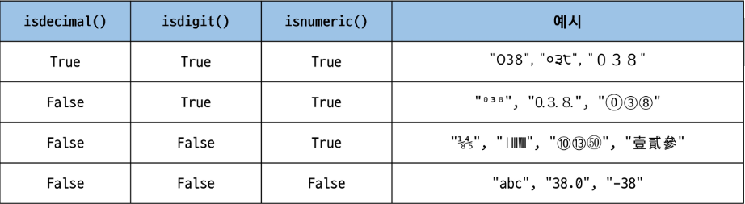

# Data Structure
* 여러 data를 효과적으로 사용, 관리하기 위한 구조(str, list, dict 등)
* 자료 구조
    * 컴퓨터 공학에서는 '자료 구조'라고 함
    * 각 data의 효율적인 저장, 관리를 위한 구조를 나눠 놓은 것
* data 구조 활용
    * str, list, dict 등 각 data 구조의 method를 호출하여 다양한 기능을 활용하기

## Method 메서드
* 객체에 속한 함수 -> 객체의 상태를 조작하거나 동작을 수행
* 특징
    * method는 class내부에 정의되는 함수
    * class는 python에서 'type을 표현하는 방법'이며 이미 은연중에 사용해왔음
    * 예를 들어 help 함수를 통해 str을 호출해 보면 class 였다는 것을 확인 가능
* 지금 당장 이 시점에서 알야아 할 것
    * method는 어딘가(class)에 속해있는 **함수**이며, 각 data type별로 다양한 기능을 가진 method가 존재한다.
* method 호출 방법
    * data_type_객체.method()
    * p.13
    

# sequence data structure

## 문자열
* 문자열 조회/탐색 및 검증 method (s는 문자열이다.)
* `s.find(x)` : x의 첫 번째 'index만'을 반환. 없으면 -1을 반환
    ```python
    print('banana'.find('a')) # 1

    print('banana'.find('z')) # -1
    ```
* `s.index(x)` : x의 첫 번째 위치를 반환. 없으면 오류 발생
    ```python
    print('banana'.index('a')) # 1

    print('banana'.index('z')) # ValueError : substring not found
    ```
* `s.isalpha()` : 알파벳 문자 여부, 단순 알파벳이 아닌 유니코드 상 letter(한국어도 포함)
    ```python
    string1 = 'Hello'
    string2 = '123'
    string3 = '12a3'

    print(string1.isalpha()) # True
    print(string2.isalpha()) # False
    print(string3.isalpha()) # False
    ```
* `s.isupper()` : 문자열이 모두 대문자로 이루어져 있는지 확인
* `s.islower()` : 문자열이 모두 소문자로 이루어져 있는지 확인
    ```python
    string1 = 'HELLO'
    string2 = 'Hello'

    print(string1.isupper()) # True
    print(string2.isupper()) # False
    print(string1.islower()) # False
    print(string2.islower()) # False
    ```
    * method에 `is`가 들어가면 boolean을 return한다.
* 문자열 조작 method (새 문자열 반환 - 문자열은 바꿀수 없기 떄문에)
    * `str.replace(old, new[,count])` : 바꿀 대상 글자를 새로운 글자로 바꿔서 변환. 여기서 []는 선택인자임을 보여준다. 실제로 python에서는 틀린 문법이기 때문에 유의해야 한다. 여기서 []를 사용한 이유는 서로 다른 문법(언어)들끼리도 알아보기 쉽게 문맥 자유 문법을 나타내기 위해 만들어진 표기법이다. 이 표기법을 '베커스 나우르'표기법(BNF)라고 한다.
        ```python
        text = 'Hello, world!'
        new_text = text.replace('world!', 'Python')
        print(new_text) # Hello, Python!
        ```
    * `str.strip([chars])` : 문자열의 시작과 끝에 있는 공백 혹은 지정한 문자를 제거
        ```python
        text = '   Hello, world!   '
        new_text = text.strip()
        print(new_text) # 'Hello, world!'
        ```
    * `str.split(sep=None, maxsplit=1)` : 지정한 문자를 구분자로 문자열을 분리하여 문자열의 list로 반환
        ```python
        text = 'Hello, world!'
        words = text.split(',')
        print(words) # ['Hello', 'world!']
        ```
    * `'separator'.join(iterable)` : iterable 요소들을 원래의 문자열을 구분자로 이용하여 하나의 문자열로 연결 (split과 반대)
        ```python
        words = ['Hello', 'world!']
        text = '-'.joni(words)
        print(text) # 'Hello-world!'
        ```
    * 기타 문자열 조작 method
        ```python
        text = 'heLLo, woRld!'
        new_text1 = text.capitalize()
        new_text2 = text.title()
        new_text3 = text.upper()
        new_text4 = text.swapcase()
        
        print(new_text1) # Hello, world!
        print(new_text2) # Hello, World!
        print(new_text3) # HELLO, WORLD!
        print(new_text4) # HEllO, WOrLD!
        ```
    * method는 이어서 사용 가능
        ```python
        text = 'heLLo, woRld!'
        new_text = text.swapcase().replace('l', 'z')
        # text에 가까이 있는 method부터 순차적으로 실행
        # str.swapcase() : 대<->소 문자 서로 변경

        print(new_text) # HEzzO, WOrLD!
        ```

## List
* list 값 추가 및 삭제 method
    * `list.append(x)` : list 마지막에 항목 x를 추가
        ```python
        my_list = [1, 2, 3]
        my_list.append(4)
        print(my_list) # [1, 2, 3, 4]
        ```
    * `list.extend(iterable)` : list에 다른 반복 가능한 객체의 모든 항목을 추가
        ```python
        my_list = [1, 2, 3]
        my_list.extend([4, 5, 6])
        print(my_list) # [1, 2, 3, 4, 5, 6]
        
        # append와의 차이점 - list를 그대로 삽입
        my_list.append([1, 2])
        print(my_list) # [1, 2, 3, 4, 5, 6, [1, 2]]
        ```
    * `list.insert(i, x)` : list의 지정한 index[i]에 항목 x를 삽입
        ```python
        my_list = [1, 2, 3]
        my_list.insert(1, 5)

        print(my_list) #[1, 5, 2, 3]
        ```
    * `list.remove(x)` : list에서 첫 번째로 일치하는 항목을 삭제
        ```python
        my_list = [1, 2, 3]
        my_list.remove(2)

        print(my_list) # [1, 3]

        my_list = [1, 3, 2, 3]
        my_list.remove(3)

        print(my_list) # [1, 2, 3]
        ```
    * `list.pop(i)` : list에서 지정한 index의 항목을 제거하고 **반환**. 작성하지 않을 경우 마지막 항목을 제거
        ```python
        my_list = [1, 2, 3, 4, 5]

        item1 = my_list.pop()
        item2 = my_list.pop(0)

        print(item1) # 5
        print(item2) # 1
        print(my_list) # [2, 3, 4]
        ```
    * `list.clear()` : list의 모든 항목을 삭제
        ```python
        my_list = [1, 2, 3]
        my_list.clear()
        
        print(my_list) # []
        ```
* list 탐색 및 정렬 method
    * `list.index(x, start, end)` : list에 있는 항목 중 가장 왼쪽에 있는 항목 x의 index를 반환
        ```python
        my_list = [1, 2, 3]
        index = my_list.index(2)
        print(index) # `
        ```
    * `list.reverse()` : list의 순서를 역순으로 변경(정렬x)
        ```python
        my_list = [1, 3, 2, 8, 1, 9]
        my_list.reverse()
        print(my_list) # [9, 1, 8, 2, 3, 1]

        print(my_list.reverse()) # None
        # return값이 없기 때문에 None을 출력한다.
        ```
    * `list.sort()` : 원본 list를 오름차순으로  정렬 (매개변수 이용 가능)
        ```python
        my_list = [3, 1, 2]
        my_list.sort()
        print(my_list) # [1, 2, 3]
        
        print(my_list.sort()) # None
        # return값이 없기 때문에 None이 출력된다.

        print(sorted(my_list)) # [1, 2, 3]
        # sort : 기존list를 변경하며 return이 없다
        # sorted : 기존list를 유지하고 새로운 list를 return한다.

        # 내림차순
        my_list.sort(reverse=True)
        print(my_list) # [3, 2, 1]
        ```
    * `list.count(x)` : list에서 항목 x의 개수를 반환
        ```python
        my_list = [1, 2, 2, 3, 3, 3]
        count = my_list.count(3)
        print(count) # 3
        ```


# 복사
* python에서는 data의 분류에 따라 복사가 달라진다.
* "변경 가능한 data type"과 "변경 불가능한 data type"을 다르게 다룬다.
    * 변경 가능한 data type의 복사
        ```python
        a = [1, 2, 3, 4]
        b = a
        b[0] = 100

        print(a) # [100, 2, 3, 4]
        print(b) # [100, 2, 3, 4]
        ```
    * 변경 불가능한 data type의 복사
        ```python
        a = 20
        b = a
        b = 10
        
        print(a) # 20
        print(b) # 10
        ```
* 복사 유형
    1. 할당(assignment)
        ```python
        original_list = [1, 2, 3]
        copy_list = original_list
        print(original_list, copy_list) # [1. 2. 3][1, 2, 3]
        
        copy_list[0] = 'hi'
        # `=`를 통한 복사는 해당 객체에 대한 객체 참조를 복사
        print(original_list, copy_list) # ['hi', 2, 3]['hi', 2, 3]
        ```
    2. 얕은 복사(shallow copy)
        ```python
        a = [1, 2, 3]
        b = a[:]
        # slicing을 통해 생성된 객체는 원본 객체와 독립적으로 존재
        print(a, b) # [1, 2, 3][1, 2, 3]
        
        b[0] = 100
        print(a, b) # [1, 2, 3][100, 2, 3]```
        ```
        * 얕은 복사의 한계
            * 2차원 list와 같이 변경 가능한 객체 안에 변경 가능한 객체가 있는 경우 - a, b의 주소는 다르지만 내부 객체의 주소는 같기 때문에 함께 변경된다.
                ```python
                a = [1, 2, [1, 2]]
                b = a[:]
                print(a, b) # [1, 2, [1, 2]][1, 2, [1, 2]]
                
                b[2][0] = 100
                print(a, b) # [1, 2, [100, 2]][1, 2, [100, 2]]
                ```
    3. 깊은 복사(deep copy)
        * 내부에 중첩된 모든 객체까지 새로운 객체 주소를 참조하도록 함
        ```python
        import copy
        
        origianl_list = [1, 2, [1, 2]]
        deep_copied_list = copy.deepcopy(original_list)
        
        deep_copied_list[2][0] = 100
        
        print(original_list) # [1, 2, [1, 2]]
        print(deep_copied_list) # [1, 2, [100, 2]]
        ```


# 참고
* 문자열에 포함된 문자들의 유형을 판별하는 mathod
* `isdecimal()` : 문자열이 모두 숫자 문자(0~9)로만 이루어져 있어야 `True`
* `isdigit()` : `isdecimal()`과 비슷하지만, 유니코드 숫자도 인식('①'도 숫자로 인식)
* `isnumeric()` : `isdigit()`과 유사하지만, 몇 가지 추가적인 유니코드 문자들을 인식 (분수, 지수, 루트 기호도 숫자로 인식)
* .isdecimal() =< .isdigit() =< .isnumeric()
    * 