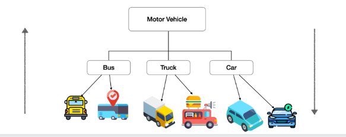
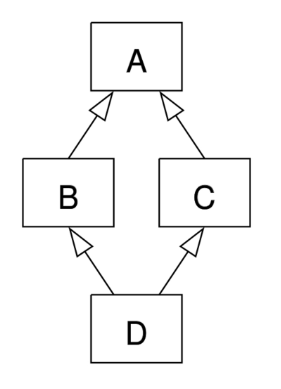
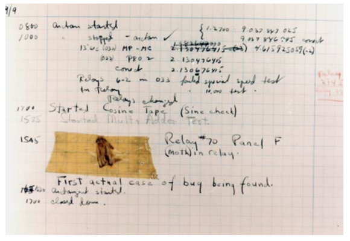
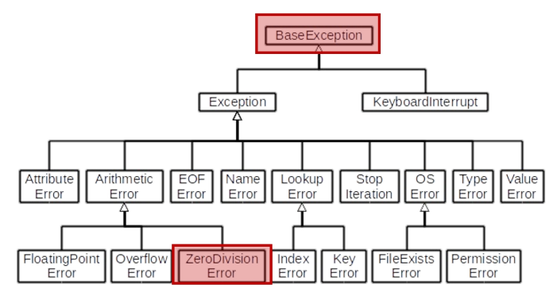
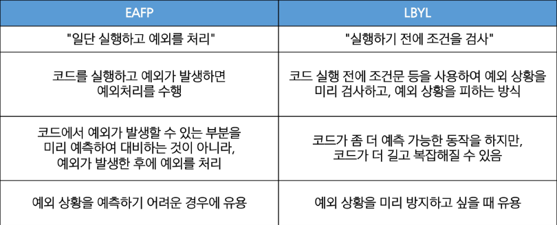

# 상속 Inheritance
* 기존 class의 속성과 method를 물려받아 새로운 하위 class를 생성하는 것
* 필요한 이유
    1. 코드의 재사용
        * 상속을 통해 기존 class의 속성과 method를 재사용할 수 있음
        * 새로운 class를 작성할 때 기존 class의 기능을 그대로 활용할 수 있으며, 중복된 code를 줄일수 있다.
    2. 계층 구조
        * 상속을 통해 class들 간의 계층 구조를 형성할 수 있음
        * 부모 class와 자식 class 간의 관계를 표현하고, 더 구체적인 class를 만들 수 있음
    3. 유지 보수의 용이성
        * 상속을 통해 기존 class의 수정이 필요한 경우, 해당 class만 수정하면 되므로 유지 보수가 용이해짐
        * code의 일관성을 유지하고, 수정이 필요한 범위를 최소화할 수 있음
        * 
    
## class의 상속
* 상위 class에는 ()없이 사용하였다. 하지만 하위 class에는 상위 class 중 누구를 상속 받을 것인지 ()안에 써줘야 한다.
    ```python
    class parent : # 상위 class
        def __init__(self)
    
    class child(parent) : # parent 상위 class 밑에 있는 child 하위 class
        def __init__(self)
    ```
* custom도 가능하다.
    ```python
    class Person :
        def __init__(self, name, age) :
            self.name = name
            self.age = age
        
        def talk(self) : # method 재사용
            print(f'반갑습니다. {self.name}입니다.')

    class Professor(Person) :
        def __init__(self, name, age, department) :
            self.name = name
            self.age = age
            self.department = department

        def talk(self) :
            print('잘부탁드립니다.')
        
        def intro(self) :
            print(f'{self.department} {self.name}입니다.')

    class Student(Person) :
        def __init__(self, name, age, gpa) :
            self.name = name
            self.age = age
            self.gpa = gpa
        
    p1 = Professor('박교수', 49, '컴퓨터공학과')
    s1 = Student('김학생', 20, 3.5)

    # Professor class의 talk method를 사용
    p1.talk() # 반갑습니다. 박교수입니다.
    p1.intro() # 컴퓨터공학과 박교수입니다.

    # 부모 Person class의 talk method를 사용
    s1.talk() # 반갑습니다. 김학생입니다.
    ```

### 상속 없이 구현하는 경우
* 다른 정보를 구분하여 사용하기 어렵다.
    ```python
    class Person :
        def __init__(self, name, age) :
            self.name = name
            self.age = age

        def talk(self) :
            print(f'반갑습니다. {self.name}입니다.')
    
    s1 = Person('김학생', 23)
    s1.talk() # 반갑습니다. 김학생입니다.

    p1 = Person('박교수', 23)
    p1.talk() # 반갑습니다. 박교수입니다.
    ```
* method의 중복
    ```python
    class Professor :
        def __init__(self, name, age, department) :
            self.name = name
            self.age = age
            self.department = department

        def talk(self) : # 중복
            print(f'반갑습니다. {self.name}입니다.')

    class Student :
        def __init__(self, name, age, gpa) :
            self.name = name
            self.age = age
            self.gpa = gpa

        def talk(self) : # 중복
            print(f'반갑습니다. {self.name}입니다.')
    ```

### 상속을 사용한 계층 구조 변경

#### super()
* 부모 class객체를 반환하는 내장 함수
* `super()`로 불러오더라도 positional parameter는 그대로 붙여줘야 한다. -> super는 인자의 정보만을 불러오기 때문이다.
    * super() 사용전
        ```python
        class Person :
            def __init__ (self, name, age, number, email) :
                self.name = name
                self.age = age
                self.number = number
                self.email = email

        class Student(Person) :
            def __init__(self, name, age, number, email, student_id) :
                self.name = name
                self.age = age
                self.number = number
                self.email = email
                self.student_id = student_id
        ```
    * super() 사용후
        ```python
        class Person :
            def __init__ (self, name, age, number, email) :
                self.name = name
                self.age = age
                self.number = number
                self.email = email

        class Student(Person) :
            def __init__(self, name, age, number, email, student_id) :
                super().__init__(self, name, age, number, email)
                self.student_id = student_id
        ```


## 다중 상속
* 둘 이상의 상위 class로부터 여러 행동이나 특징을 상속받을 수 있는 것
* 상속받은 모든 class의 요소를 활용 가능함
* 중복된 속성이나 method가 있는 경우 **상속 순서**에 의해 결정됨.
* 다중 상속의 예시
    ```python
    class Person :
        def __init__ (self, name) :
            self.name = name

        def greeting(self) :
            return f'안녕, {self.name}'

    class Mom(Person) :
        gene = 'XX'

        def swim(self) :
            return '엄마가 수영'

    class Dad(Person) :
        gene = 'XY'

        def walk(self) :
            return '아빠가 걷기'

    class FirstChild(Dad, Mom) :
        def swim(self) :
            return '첫째가 수영'
        
        def cry(self) :
            return '첫째가 응애'
        
    baby1 = FirstChild('아가')
    print(baby1.cry()) # 첫째가 응애
    print(baby1.swim()) # 첫째가 수영
    print(baby1.walk()) # 아빠가 걷기
    print(baby1.gene) # XY
    ```
* 다이아몬드 문제(The diamond problem)
    * 두 class B와 C가 A에서 상속되고, class D가 B와 C 모두에서 상속될 때 발생하는 모호함
    * B와 C가 재정의한 method가 A에 있고 D가 이를 재정의하지 않는 경우라면?
    * D는 B의 method 중 어떤 버전을 상속하는가?  아니면 C의 method 버전을 상속하는가?
    * 
    * D -> B -> C -> A 순서로 적용된다.
* python에서의 해결책
    * MRO(Method Resolution Order) 알고리즘을 사용하여 class 목록을 생성
    * 부모 classs로부터 상속된 속성들의 검색을 깊이 우선으로, 왼쪽에서 오른쪽으로, 계층 구조에서 겹치는 같은 class를 두 번 검색하지 않는다.
    * 그래서, 속성이 D에서 발견되지 않으면, B에서 찾고, 거기에서도 발견되지 않으면 C에서 찾고, 이런식으로 진행된다.
        ```python
        class D(B, C) :
            pass
        ```

### MRO
* Method Resolution Order : method의 결정 순서
* `super()` : 부모 class 객체를 반환하는 내장 함수
    * 다중 상속 시 MRO를 기반으로 현재 class가 상속하는 모든 부모 class중 다음에 호출될 method를 결정하여 자동으로 호출
        ```python
        class ParentA :
            def __init__ (self) :
                self.value_a = 'ParentA'

            def show_value(self) :
                print(f'Value form ParentA: {self.value_a}')

        class ParentB :
            def __init__ (self) :
                self.value_b = 'ParentB'

            def show_value(self) :
                print(f'Value form ParentB: {self.value_b}')


        class Child(ParentA, ParentB) :
            def __init__(self) :
                super().__init__() # ParendA class의 __init__ method 호출
                self.value_c = 'Child'

            def show_value(self) :
                super().show_value() # ParentA class의 show_vlaue method 호출
                print(f'Value from Child: {self.value_c}')

        child = Child()
        child.show_value()
        """
        출력결과
        Value form ParentA: ParentA
        Value from Child: Child
        """
        ```
    * 찾는 것과 출력되는 것은 반대이다! 찾을 때 바로 출력되는 것이 아니라 쌓아두는 것으로 생각하고 출력은 쌓아둔 것을 위에서부터 차례대로 출력한다고 생각하면 된다. B->C->D->A 순서로 쌓이지만 출력은 A->D->C->B 순서로 출력된다.
        ```python
        class A :
            def __init__(self) :
                print('A Constructor')

        class B(A) :
            def __init__(self) :
                super().__init__()
                print('B Constructor')

        class C(A) :
            def __init__(self) :
                super().__init__()
                print('C Constructor')

        class D(B, C) :
            def __init__(self) :
                super().__init__()
                print('D Constructor')


        obj = D()
        """
        출력 결과
        A Constructor
        C Constructor
        B Constructor
        D Constructor
        """
        print(D.mro())
        """
        [<class '__main__.D'>,
        <class '__main__.B'>,
        <class '__main__.C'>,
        <class '__main__.A'>,
        <class 'object'>]
        """
        ```
* `mro()` method
    * 해당 instance의 class가 어떤 부모 class를 가지는지 확인하는 method
    * 기존의 instance -> class 순으로 namespace를 탐색하는 과정에서 상속관계에 있으면 instance -> 자식 class -> 부모 class로 확장
* super의 2가지 사용 사례
    1. 단일 상속 구조
        * 명시적으로 이름을 지정하지 않고 부모 class를 참조할 수 있으므로, code를 더 유지 관리하게 쉽게 만들 수 있음
        * class 이름이 변경되거나 부모 class가 교체되어도 super()를 사용하면 code수정이 더 적게 필요
    2. 다중 상속 구조
        * MRO를 따른 method 호출
        * 복잡한 다중 상속 구조에서 발생할 수 있는 문제를 방지
* MRO가 필요한 이유
    * 부모 class들이 여러먼 access가 되지 않도록, 각 class에서 지정된 왼쪽에서 오른쪽으로 가는 **순서를 보존**하고, 각 부모를 오직 한번만 호출하고, 부모들의 우선순위에 영향을 주지 않으면서 subclass를 만드는 **단조적인 구조 형성**
    * programming 언어의 신뢰성 있고 확장성 있는 class를 설계할 수 있도록 도움
    * class간의 method 호출 순서가 예측 가능하게 유지되며, code의 재사용성과 유지보수성이 향상


# Error와 예외

## 디버깅
* bug : software에서 발생하는 오류 또는 결함. program의 예상된 동작과 실제 동작 사이의 불일치
* bug의 기원
    * 최초의 bug는 945년 programming 언어의 일종인 코볼 발명자 그레이스 호퍼가 발견
    * 역사상 최초의 컴퓨터 버그는 Mark II 라는 컴퓨터 회로에 벌레인 나방이 들어가 합선을 일으켜 비정상적으로 동작한 것을 기록한것
    * "bug"라는 용어는 이전부터 사용되어 왔지만 이 사건을 게기로 컴퓨터 시스템에서 발생하는 오류 또는 결함을 지칭하는 용어로 널리 사용되기 시작
    * 실제 bug가 발견된 최초의 사례
    * 

* Debugging : software에서 발생하는 bug를 찾아내고 수정하는 과정. program의 오작동 원인을 식별하여 수정하는 작업
* Debugging 방법
    1. print 함수 활용
        * 특정 함수 결과, 반복/조건 결과 등 나눠서 생각. code를 bisection으로 나눠서 생각
    2. 개발 환경(text editor, IDE) 등에서 제공하는 기능 활용
        * breakpoint, 변수 조회 등
    3. python tutor 활용 (단순 python code인 경우)
    4. 뇌 컴파일, 눈 디버깅 등..ㅋㅋㅋ 즉 본인 재량..

## Error
* Error : program 실행 중에 발생하는 예외 상황
* python Error 유형
    1. Syntax Error (문법 에러) : program의 구문이 올바르지 않은 경우 발생 (오타, 괄호 및 콜론 누락 등의 문법적 오류)
    2. Exception (예외) : program 실행 중에 감지되는 Error
* SyntaxError example
    * invalid syntax (문법 오류)
        ```python
        while # SyntaxError: invalid syntax
        ```
    * assign to literal (잘못된 할당)
        ```python
        5=3 # SyntaxError: cannot assign to literal
        ```
    * EOL (End of Line)
        ```python
        print('hello
        # SyntaxError: EOL while scanning string literal
        ```
    * EOF (End of File)
        ```python
        print(
        # SyntaxError: unexpected EOF while parsing
        ```

## 예외 (Exception)
* program 실행 중에 감지되는 Error
* 내장 예외 (Built-in Exceptions) : 예외 상황을 나타내는 예외 class들
    * python에서 이미 정의되어 있으며, 특정 예외 상황에 대한 처리를 위해 사용
    * `ZeroDivisionError` : 나누기 또는 module로 연산의 두 번째 인자가 0일때 발생
        ```python
        10/0 # ZeroDivisionError: division by zero
        ```
    * `NameError` : 지역 또는 전역 이름을 찾을 수 없을 때 발생
        ```python
        print(name_error)
        # NameError: name 'name_error' is not defined
        ```
    * `TypeError`
        * type 불일치
            ```python
            '2'+2
            # TypeError: can only concatenate str (not "int") to str
            ```
        * 인자 누락
            ```python
            sum()
            # TypeError: sum() takes at least 1 positional argument (0 given)
            ```
        * 인자 초과
            ```python
            sum(1, 2, 3) # TypeError: sum() takes at most 2 arguments (3 given)
            ```
        * 인자 type 불일치
            ```python
            import random
            random.sample(1, 2)
            # TypeError: Population must be a sequence.  For dicts or sets, use sorted(d).
            ```
    * `ValueError` : 연산이나 함수에 문제가 없지만 부적적한 값을 가진 인자를 받았고, 상황이 IndexError처럼 더 구체적인 예외로 설명되지 않는 경우 발생
            ```python
            int('1.5')
            # ValueError: invalid literal for int() with base 10: '1.5'

            range(3).index(6)
            # ValueError: 6 is not in range
            ```
    * `IndexError` : sequence index가 범위를 벗어날때 발생
        ```python
        empty_list = []
        empty_list[2] 
        # IndexError: list index out of range
        ```
    * `KeyError` : dictionary에 해당 key가 존재하지 않는 경우
        ```python
        person = {'name' : 'Alice'}
        person['age'] # KeyError: 'age'
        ```
    * `ModuleNotFoundError` : module을 찾을 수 없을 때 발생
        ```python
        import hahaha
        # ModuleNotFoundError: No module named 'hahaha'
        ```
    * `ImportError` : import 하려는 이름을 찾을 수 없을 때 발생
        ```python
        from random import hahaha
        # ImportError: cannot import name 'hahaha' from 'random'
        ```
    * `KeyboardInterrupt` : 사용자가 Control-C 또는 Delete를 누를때 발생
        * 무한 loop에서 강제 종료시
        ```python
        while True :
            continue
        """
        Traceback (most recent call last):
            File "...", line 2, in <module>
               continue
        KeyboardInterrupt
        """
        ```
    * `IndentationError` : 잘못된 들여쓰기와 관련된 문법 오류
        ```python
        for i in range(10) :
        print(i)
        # IndentationError: expected an indented block
        ```

## 예외 처리
* `try`와 `except` : python에서는 try문과 except절을 사용하여 예외 처리
* try-except 구조
    * try block 안에는 예외가 발생할 수 있는 code를 작성
    * except block 안에는 예외가 발생했을 때 처리할 code를 작성
    * 예외가 발생하면 program 흐름은 try block을 빠져나와 해당 예외에 대응하는 except block으로 이동
        ```python
        try :
            # 예외가 발생할 수 있는 code
        except 예외 :
            # 예외 처리 코드
        ```
    * example
        ```python
        try :
            result = 10 / 0
        except ZeroDivisionError :
            print('0으로 나눌 수 없습니다.')
        ```
        ```python
        try :
            num = int(input('숫자 입력 : '))
        except ValueError :
            print('0으로 나눌 수 없습니다.')
        # 숫자 입력 : a
        # 0으로 나눌 수 없습니다.
        ```
* 내장 예외의 상속 계층 구조 주의
    * 다음과 같이 예외를 작성하면 code 2번째 except 절에 이후로 도달하지 못함
        ```python
        try :
            num = int(input('100으로 나눌 값을 입력하시오 : '))
            print(100 / num)
        except BaseException :
            print('숫자를 넣어주세요.') # 이후 블록에는 도달하지 못함
        except ZeroDivisionError :
            print('0으로 나눌 수 없습니다.')
        except :
            print('에러가 발생하였습니다.')
        ```
    * 내장 예외 class는 상속 계층 구조를 가지기 때문에 except 절로 분기 시 **반드시 하위 class를 먼저 확인할 수 있도록 작성**해야 한다.
        * 

## as
* as 키워드를 활용하여 Error message를 except block에서 사용할 수 있음
    ```python
    my_list = []

    try :
        number = my_list[1]
    except IndexError as error :
        print(f'{error}가 발생하였습니다')
    # list index out of range가 발생하였습니다
    ```

# EAFP & LBYL
* 예외처리와 값 검사에 대한 2가지 접근 방식
    1. EAFP : Easier to Ask for Forgiveness than Permission
        * 예외처리를 중심으로 code를 작성하는 접근 방식(try-except)
    2. LBYL : Look Before You Leap
        * 값 검사를 중심으로 code를 작성하는 접근 방식 (if-else)
* EAFP vs LBYL
    ```python
    # EAFP
    my_dict = []

    try :
        result = my_dict['key']
        print(result)
    except KeyError :
        print('Key가 존재하지 않습니다.')
    ```
    ```python
    # LBYL
    my_dict = []

    if 'key' in my_dict :
        result = my_dict['key']
    else :
        print('Key가 존재하지 않습니다.')
    ```
* 접근 방식 비교
    * 


