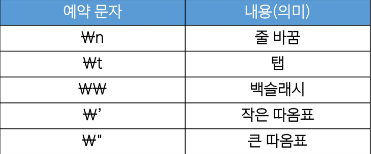

# Programming
* 새 연산을 정의하고 조합해 유용한 작업을 수행하는 것.
    * =>문제를 해결하는 매우 강력한 방법
* programming 언어 = 컴퓨터에게 작업을 지시하고 문제를 해결하는 도구


# Python

## python을 사용하는 이유
1. 간결하고 읽기 쉬운 문법
2. 다양한 응용 분야
    * data분석, 인공지능, Web개발, 자동화 등
3. python 커뮤니티 지원
    * 세계적인 규모의 풍부한 online 포럼 및 커뮤니티 생태계
## 표현식과 값
* 표현식(Expression) : 값, 변수, 연산자 등을 조합하여 계산되고 결과를 내는 code구조
* 평가(Evaluate) : 표현식이나 문장을 실행하여 그 결과를 계산하고 값을 결정하는 과정 -> 표현식이나 문장을 순차적으로 평가하여 프로그램의 동작을 결정
* 문장(Statement) : 실행 가능한 동작을 기술하는 code (조건문, 반복문, 함수 정의 등)
    * statement는 보통 여러 개의 exprssion을 포함
* type : 값이 어떤 종류의 data인지, 어떻게 해석되고 처리되어야 하는지를 정의
    * data type
        * Numeric type
            1. int 정수
            2. float 실수
            3. complex 복소수
        * Sequence type
            1. list
            2. tuple
            3. range
        * Text sequence type
            * str 문자열
        * Set type
            * set
        * Mapping type
            * dict
        * 기타
            1. None
            2. Boolean
            3. Functions
* 산술 연산자
    * 연산자
        * `-` : 음수부호
        * `+` : 덧셈
        * `-` : 뺄셈
        * `*` : 곱셈
        * `/` : 나눗셈
        * `//` : 정수 나눗셈(몫)
        *  `%` : 나머지
        * `**` : 지수(거듭제곱)
    * 우선 순위
        * `**`>`-`(음수 부호)> `*`,`/`,`//`,`%` > `+`,`-`

## 변수(Variable)
* 값을 참조하는 이름

### 변수명 규칙
* 영문 alphabet, `_`, 숫자로 구성
* 숫자로 시작할 수 없음
* 대소문자 구별
* 아래 키워드는 python 내부 예약어로 사용할 수 없음
    * `False`, `None`, `True`, ` __peg_parser__`, `and`, `as`, `assert`, `async`, `await`, `break`, `class`, `continue`, `def`, `del`, `elif`, `else`, `except`, `finally`, `for`, `from`, `global`, `if`, `import`, `in`, `is`, `lambda`, `nonlocal`, `not`, `or`, `pass`, `raise`, `return`, `try`, `while`, `with`, `yield`

### 변수, 값, 그리고 메모리
* 메모리의 모든 위치에는 그 위치를 고유하게 식별하는 메모리 주소가 존재
* 객체(object)
    * type을 갖는 메모리 주소 내 값
    * "값이 들어있는 상자"
* 변수는 그 변수가 참조하는 객체의 메모리 주소를 가짐
* 할당문
    * `variable = expression`
    1. 할당 연산자 `=` 오른쪽에 있는 expression을 평가해서 값(메모리 주소)를 생성
    2. 값의 메모리 주소를 `=` 왼쪽에 있는 변수에 저장
        * 존재하지 않는 변수라면 새 변수 생성
        * 기존에 존재했던 변수라면 기존 변수를 재사용해서 변수에 있는 메모리 주소를 변경
    * 예시
        ```python
        number = 10
        double = 2 * number
        print(double) # 결과값 20

        number = 5 # number를 새로 지정함
        print(double)
        # number가 바뀌었지만 double은 위에서 20이라고 이미 입력된 상태 이기 때문에 결과값으로 20이 출력됨
        ```

# Style Guide
* code의 일관성과 가독성을 향상시키기 위한 규칙과 권장 사항들의 모음

## python style guide
* 변수명은 무엇을 위한 변수인지 직관적인 이름을 가져야 함
* 공백(space) 4칸을 사용하여 code block을 들여쓰기
* 한 줄의 길이는 79자로 제한하며, 길어질 경우 줄 바꿈을 사용
* 문자와 밑줄(_)을 사용하여 함수, 변수, 속성의 이름을 작성
* 함수 정의나 class 정의 등의 block 사이에는 빈 줄을 추가
* ...
* [기타 규칙들](https://peps.python.org/pep-0008/)

## python tutor
* python program이 어떻게 실행되는지 보여주는 시각화 도움
* [python tutor](https://pythontutor.com/)

## 주석(comment)
* program code 내에 작성되는 설명이나 memo
* interpreter에 의해 실행되지 않는다.
* 목적
    1. code의 특정 부분을 설명하거나 임시로 code를 비활성화 할 때
    2. code를 이해하거나 문서화 하기 위해서
    3. 다른 개발자나 자신에게 code의 의도나 동작을 설명하는 데 도움


# Data types
* 값의 종류와 그 값에 적용 가능한 연산과 동작을 결정하는 속성
* 필요한 이유
    1. 값들을 구분하고, 어떻게 다뤄야 하는지를 알 수 있다.
    2. 각 data type 값들도 각각 적합한 도구를 가진다.
    3. type을 명시적으로 지정하면 code를 읽는 사람이 변수의 의도를 더 쉽게 이해할 수 있고, 잘못된 data type으로 인한 오류를 미리 예방 가능하다.

## Numeric type
* int : 정수 자료형
    * 진수 표현
        1. 일반적으로 사용하면 10진수
        2. 2진수(binary) : `0b`
        3. 8진수(octal) : `0o`
        4. 16진수(hexadecimal) : `0x`
* float : 실수 자료형
    * programming 언어에서 float은 실수에 대한 근삿값
    * 유한 정밀도
        * 컴퓨터 메모리 용량이 한정되어 있고 한 숫자에 대해 저장하는 용량이 제한됨
        * 0.666과 1.6667은 제한된 양의 메모리에 저장할 수 있는 2/3과 5/3에 가장 가까운 값이다.
            ```python
            print(2/3) #0.6666666666666666
            print(5/3) #1.6666666666666667
            ```
    * 실수 연산 시 주의 사항
        * 컴퓨터는 2진수 사용, 사람은 10진수 사용
        * 이때 10진수 0.1은 2진수로 표현하면 0.00011001100110011... 같이 무한대로 반복
        * 무한대 숫자를 그대로 저장할 수 없어서 사람이 사용하는 10진법의 근삿값만 표시
        * 0.1의 경우 `3602879701896397 / 2 ** 55`이며 0.1에 가깝지만 정확히 동일하지는 않음
        * 이런 과정에서 예상치 못한 결과가 나타남
        * 이런 증상을 Floating point rounding error라고 함
    * 실수 연산 시 해결책
        * 두 수의 차이가 매우 작은 수보다 작은지를 확인하거나 math 모듈을 활용
        * 지수 표현 방식
            * e 또는 E를 사용한 지수 표현을 사용
                ```python
                # 314 * 0.01
                number = 314e-2
                ```

## Sequence type
* 여러 개의 값들을 순서대로 나열하여 저장하는 자료형
* str, list, tuple, range
* 특징
    * sequence : 값들을 순서대로 저장 (정렬X)
    * indexing : 각 값에 고유한 번호를 가지고 있으며, index를 사용하여 특정 위치의 값을 선택하거나 수정할 수 있음
    * slicing : index 범위를 조절해 부분적인 값을 추출할 수 있음
    * length : `len()`함수를 사용하여 지정된 값으 개수(길이)를 구할 수 있음
    * iteration : 반복문을 사용하여 저장된 값들을 반복적으로 처리할 수 있음

### str 문자열
* 문자들의 순서가 있는 변경 불가능한 sequence 자료형
* 문자열은 단일 문자나 여러 문자의 조합으로 이루어짐
* `''` Ehsms `""`로 감싸서 표현
    ```python
    # Hello, World!
    print('Hello, World!')
    
    # <class 'str'>
    print(type('Hello, World!'))
    ```
* 중첩 따옴표
    * 따옴표 안에 따옴표를 표현할 경우
        * `''`가 있는경우 `""`로 문자열 생성
        * `""`가 있는경우 `''`로 문자열 생성
            ```python
            # '작은 따옴표'
            print("'작은 따옴표'")

            # "큰 따옴표"
            print('"큰 따옴표"')
            ```
* escape sequence
    * 역슬래쉬(backslash)뒤에 특정 문자가 와서 특수한 기능을 하는 문자 조합
    * python의 일반적인 문법규칙을 잠시 탈출한다는 의미
        
        ```python
        # 출력 '안녕'
        print('출력 \'안녕\'')

        # 이 다음은 엔터
        # 입니다.

        print('이 다음은 엔터\n입니다.')
        ```
* string interpolation : 문자열 내에 변수나 표현식을 삽입하는 방법
    * f-string
        * 문자열에  `f`또는 `F`접두어를 붙이고 표현식을 `{expression}`형태로 작성하여 문자열에 python 표현식의 값을 삽입할 수 있다.
            ```python
            # 사과는 apple
            a = 'apple'
            print(f'사과는 {a}')
            ```

### index
* sequence 내의 값들에 대한 고유한 번호로, 각 값의 위치를 식별하는데 사용되는 숫자
* 앞에서부터 차례대로 0, 1, 2, 3, ... 의 값을 가지며 동시에 뒤에서부터 -1, -2, -3, ...의 값을 갖는다.

### slicing
* sequence의 일부분을 선택하여 추출하는 작업
* 시작 index와 끝 index를 지정하여 해당 범위의 값을 포함하는 새로운 sequence를 생성
    * `[a:b]` : a번째 이상 b번째 미만
    * `[a:]` : a번째 부터 끝까지
    * `[:b]` : 처음부터 b번째 미만 까지
    * `[a:b:c]` : a번째 이상 b번째 미만 c만큼의 간격으로 (단 c가 음수일 경우 a가 b보다 커야 한다.)