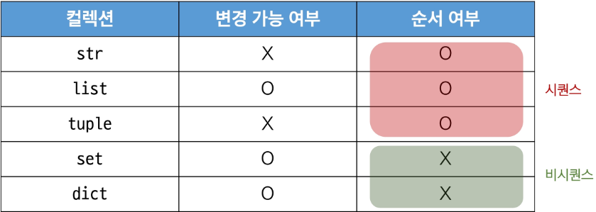
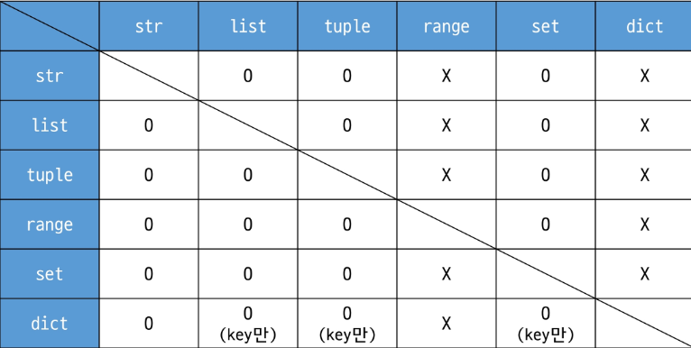

# Date type
* 값의 종류와 그 값에 적용 가능한 연산과 동작을 결정하는 속성
    * Numeric type - int, float, comlex
    * Text sequence type - str
    * Sequence type - list, tuple, range
    * Non-sequence type - set, dict
    * 기타 - Boolean, None, Functions

# Sequence type
* 여러 개의 값들을 **순서대로 나열**하여 저장하는 자료형
    * str(변경x), list(변경o), tuple, range
* 특징 - sequence, indexing, slicing, length, iteration
## list
* 여러 개의 값을 순서대로 저장하는 **변경 가능**한 sequece 자료형
* list 표현
    * 0개 이상의 객체를 포함하며 data 목록을 저장
    * `[]`로 표기
    * data는 어떤 자료형도 저장할 수 있음
        ```python
        my_list = []
        my_list = [1, 'a', 3, 'b', 5]
        my_list = [1, 2, 3, 'python', ['hello', 'world', '!']] # list 내부에 list도 가능
        ```
* list의 sequence 특징
    * indexing, slicing, length
* 중첩된 list의 접근
    ```python
    my_list = [1, 2, 3, 'python', ['hello', 'world', '!']]
    print(lem(my_list)) # 5
    print(my_list[4][-1]) # !
    print(my_list[-1][1][0]) # w
    ```
* list는 변경 가능
    ```python
    my_list = [1, 2, 3]
    my_list[0] = 100
    print(my_list) # [100, 2, 3]
    ```

## tuple
* 여러 개의 값을 순서대로 저장하는 변경 불가능한 sequence 자료형
* tuple의 표현
    * 0개 이상의 객체를 포함하여 data 목록을 저장
    * 소괄호 `()`로 표기
    * data는 어떤 자료형도 저장할 수 있음
        ```python
        my_tuple1 = ()
        my_tuple2 = (1,)   # 정수 1과 구분하기 위해서 ,를 사용한다.
        my_tuple3 = (1, 'a', 3, 'b', 5)
        ```
* tuple 의 sequence 특징
    * indexing, slicing, length
    * 불변(변경 불가)
        ```python
        my_tuple = (1, 2, 3)
        
        my_tuple[1] = 4
        # TypeError가 뜬다. tuple은 변경 불가 이기 때문에
        ```
* tuple의 쓰임
    * tuple의 불변 특성을 사용한 안전하게 여러 개의 값을 전달, 그룹화, 다중 할당 등 개발자가 직접 사용하기 보다 '파이썬 내부 동작'에서 주로 사용됨
        ```python
        x, y = (10, 20)
        
        print(x) # 10
        print(y) # 20
        
        x, y = 10, 20
        # python은 tuple 생성자로 사용하니 괄호는 생략 가능
        ```

## range
* 연속된 정수 sequence를 생성하는 변경 불가능한 자료형
* range expression
    * `range(n)` : 0부터 (n-1)까지의 숫자 sequence
    * `range(n, m)` : n부터  (m-1)까지의 숫자 sequence
    * 주로 반복문과 함께 사용하는 경우가 대부분이다.
    * list로 형 변환 시 data 확인 가능하다.
        ```python
        my_range = range(5)
        print(my_range) # range(0, 5)
        print(list(my_range)) # [0, 1, 2, 3, 4]
        ```

# Non-sequence type

## dict 딕셔너리
* key - value 쌍으로 이루어진 순서와 중복이 없는 변경 가능한 자료형
* dict expression
    * key는 변경 불가능한 자료형만 사용 가능 : str, int, float, tuple, range...
    * value는 모든 자료형 사용 가능
    * `{}`로 표현
        ```python
        my_dict1 = {}
        my_dict2 = {'key' : 'value'}
        my_dict3 = {'apple' : 12, 'list' : [1, 2, 3]}

        print(my_dict1) # {}
        print(my_dict2) # {'key' : 'value'}
        print(my_dict3) # {'apple' : 12, 'list' : [1, 2, 3]}
        ```
* dict의 사용
    * key를 통해 value에 접근
    * key는 중복이 불가능하기 때문에 key가 중복이 된다면 마지막에 입력한 value가 출력된다.
        ```python
        my_dict = {'apple' : 12, 'list' : [1, 2, 3], 'apple' : 100}
        
        print(my_dict) # {'apple' : 100, 'list' : [1, 2, 3]}
        # 'key'에 'apple'이 중복됨
        ```

## set
* 순서와 중복이 없는 변경 가능한 자료형
* set expression
    * 수학에서의 집합과 동일한 연산 처리 가능
    * `{}`로 표기
        ```python
        my_set_1 = set()
        my_set_2 = {1, 2, 3}
        my_set_3 = {1, 1, 1}
        
        print(my_set_1) # set()
        # dict의 {}와 구분하기 위해서 set()을 사용한다.
        print(my_set_2) # {1, 2, 3}
        print(my_set_3) # {1}
        ```
* set의 집합 연산
    ```python
    my_set_1 = {1, 2, 3}
    my_set_2 = {3, 6, 9}

    # 합집합 : enter key위쪽에 'shift+\'
    print(my_set_1 | my_set_2) # {1, 2, 3, 6, 9}

    # 차집합
    print(my_set_1 - my_set_2) # {1, 2}

    # 교집합
    print(my_set_1 & my_set_2) # {3}
    ```

# Other type

## None
* python에서 '값이 없음'을 표현하는 자료형
    ```python
    variable = None
    print(variable) # None
    ```

## Boolean
* True와 False를 표현하는 자료형
* boolean expression
    * 비교/논리 연산의 평가 결과로 사용됨
    * 주로 조건/반복문과 함께 사용
        ```python
        bool_1 = True
        bool_2 = False
        
        print(bool_1) # True
        print(bool_2) # False
        print(3 >1) # True
        print('3' != 3) # True
        ```

# Collection
* 여러 개의 항목 또는 요소를 담는 자료 구조
    * str, list, tuple, set, dict
    * collection 정리
        


# Type conversion

## Implicit Type conversion 암시적 형변환
* python이 자동으로 형변환을 하는것
* Boolean과 Numeric type에서만 가능
    ```python
    print(3+ 5.0) # 8.0
    # int와 float이 만나면 자동적으로 float이 출력된다.

    print(True + 3) # 4
    # Boolean과 Numberic이 만나면 Boolean이 Numeric으로 바뀐다.
    # True값은 1로 암시적 형변환이 일어난다.
    
    print(True + False) # 1
    # Boolean과 Boolean이 만나면 모두 Numeric으로 바뀐다.
    # True는 1, False는 0으로 형변환이 일어난다.
    ```

## Explicit Type conversion 명시적 형변환
* 개발자가 직접 형변환을 하는 것
* 암시적 형변환이 아닌 경우를 모두 포함
* 예시
    * str -> integer : 형식에 맞는 숫자만 가능
    * integer -> str : 모두 가능
    * 이 외에도 수많은 경우가 있음
        ```python
        print(int('1')) # 1
        print(int('3.5')) # Error
        print(float('3,5')) # 3.5
        
        print(str(1) + '등') # 1등

        print(int(3.5)) # 3
        ```
* collection 간 형변환 정리
    * 전부 외우거나 할 필요는 없지만 error가 뜨면 그때 바꿔주면 된다.
    

# 연산자

## 산술 연산자
* `-` : 음수 부호 or 뺄셈
* `+` : 덧셈
* `*` : 곱셈
* `/` : 나눗셈
* `//` : 정수 나눗셈(몫)
* `%` : 나머지
* `**` : 지수(거듭제곱)

## 복합 연산자
* 연산과 할당이 함께 이루어짐


## 비교 연산자
* 기본적인 비교 연산자 : 결과값으로 True/False로 나온다.
    * `<` : 미만
    * `<=` : 이하
    * `>` : 초과
    * `>=` : 이상
    * `==` : 같음
    * `!=` : 같지 않음
* is 비교 연산자
    * 메모리 내에서 같은 객체를 참조하는지 확인
        ```python
        print(3 == 3.0) # True
        print(3 is 3.0) # False
        ```
    * `==`는 동등성(equality), `is`는 식별성(identity)
    * 값을 비교하는 `==`와 다름
        1. is : 같음
        2. is not : 같지 않음
    * is 연산자는 되도록이면 None, True, False 등을 비교할 때 사용

## 논리 연산자
1. `and` 논리곱 : 두 피연산자 모두 True인 경우에만 전체 표현식을 True로 평가
2. `or` 논리합 : 두 피연산자 중 하나라도 True인 경우 전체 표현식을 True로 평가
3. `not` 논리 부정 : 단일 피연산자를 부정
    ```python
    print(True and False) # False

    print(True or False) # True

    print(not True) # False

    print(not 0) # True
    ```
* 비교 연산자와 함께 사용 가능
    ```python
    num = 15
    result = (num > 10) and (num % 2 == 0)
    print(result) # False

    name = 'Alice'
    age = 25
    result = (name == 'Alice') or (age == 30)
    print(result) # True
    ```
* 단축 평가
    * 논리 연산에서 두 번째 피연산자를 평가하지 않고 결과를 결정하는 동작
    * 판별하기 위해 가장 마지막에 보는(마지막으로 봐야 하는) 요소가 전체를 결정한다.
       ```python
        print(A) # False
        print(B) # True
        
        print(A and B)
        # B를 생각하지 않고 A만 보고 False로 단축평가 한다.
        ```
        ```python
        vowels = 'aeiou'
        print(('a' and 'b') in vowels)
        # 문자열은 언제나 True이기 때문에 and의 경우 뒤의 값을 봐야한다.
        # print('b' in vowels) 가 되어 False가 된다.
        print(('b' and 'a') in vowels)
        # print('a' in vowels) 가 되어 True가 된다.

        print(3 and 5) # 5
        # 3과 5 모두 True이기 때문에 5가 출력된다.
        print(3 and 0) # 0
        # 0은 암묵적 변환에 의해 False이기 때문에 
        print(0 and 3) # 0
        # 0값이 False이기 때문에 바로 0을 출력
        print(0 and 0) # 0

        print(5 or 3) # 5
        # 5가 True 값이기 때문에 5를 출력
        print(3 or 0) # 3
        print(0 or 3) # 3
        # 0이 False이기 때문에 뒤에 3 True까지 보고 3을 출력
        print(0 or 0) # 0
        # 둘다 False이기 때문에 0 출력
        ```
    * 단축 평가 동작
        * and
            * 첫 번째 피연산자가 False인 경우, 전체 표현식은 False로 결정. 두 번째 피연산자는 평가되지 않고 그 값이 무시
            * 첫 번째 피연산자가 True인 경우, 전체 표현식의 결과는 두 번째 피연산자에 의해 결정. 두 번째 피연산자가 평가되고 그 결과가 전체 표현식의 결과로 반환
        * or
            * 첫 번째 피연산자가 True인 경우, 전체 표현식은 True로 결정. 두 번째 피연산자는 평가되지 않고 그 값이 무시
            * 첫 번째 피연산자가 False인 경우, 전체 표현식의 결과는 두 번째 피연산자에 의해 결정. 두 번째 피연산자가 평가되고 그 결과가 전체 표현식의 결과로 반환.
    * 단축 평가 이유
        * code 실행을 최적화하고 , 불필요한 연산을 피할 수 있도록 함

## 멤버십 연산자
* 특정 값이 sequence나 다른 collection에 속하는지 여부를 확인
    * `in` : 왼쪽 피연산자가 오른쪽 피연산자의 sequence에 속하는지를 확인
    * `not in` : 왼쪽 피연산자가 오른쪽 피연산자의 sequence에 속하지 않는지를 확인
        ```python
        word = 'hello'
        numbers = [1, 2, 3, 4, 5]

        print('h' in word) # True
        print('z' in word) # False

        print(4 not in numbers) # False
        print(6 not in numbers) # True
        ```

## sequence형 연산자
* `+`와 `*`는 sequence간 연산에서 산술 연산자일때와 다른 역할을 가진다.
    * `+` : 결합
    * `*` : 반복