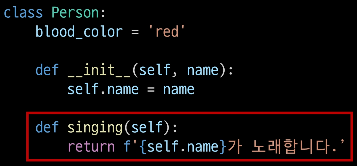

# 객체 지향 프로그래밍
* Object-oriented Programming

## Procedural Programming (PP)
* 절차 지향 프로그래밍
* program을 'data'와 '절차'로 구성하는 방식의 program paradigm
* 특징
    * 'data'와 해당 data를 처리하는 "function(절차)"가 분리되어 있으며, function 호출의 흐름이 중요
    * code의 순차적인 흐름과 function 호출에 의해 program이 진행
    * 실제로 실행되는 내용이 무엇이 무엇인가가 중요
    * data를 다시 재사용하거나 하기보다는 처음부터 끝까지 실행되는 결과물이 중요한 방식
    * Hardware의 발전으로 컴퓨터 계산 용량과 문제의 복잡성이 급격히 증가함에 따라 software에 충격이 발생
        

## Object Oriented Programming (OOP)
* 객체 지향 프로그래밍
* data와 해당 data를 조작하는 method를 하나의 객체로 묶어 관리하는 방식의 program paradigm.
* 절차 지향 vs 객체 지향
    * 
    * PP vs OOp
        * PP
            * data와 해당 data를 처리하는 function(절차)가 분리
            * function 호출의 흐름이 중요
        * OOP
            * data와 해당 data를 처리하는 method(message)를 하나의 객체(class)로 묶음
            * 객체 간 상호작용과 message 전달이 중요

# 객체

## class (클래스)

* python에서 type을 표현하는 방법
    * 객체를 생성하기 위한 설계도
    * data와 기능을 함께 묶는 방법을 제공

## 객체 (Object)
* class에서 정의한 것을 토대로 memory에 할당된 것
    * **속성**과 **행동**으로 구성된 모든 것
    * 
* class와 object
    * class로 만든 객체를 **instance**라고도 함
    * 
        * 아이유는 객체다 (O)
        * 아이유는 instance다 (X)
        * 아이유는 가수의 instance다 (O)
    * class또한 객체이고 instance 또한 객체이다. class를 통해 만든 객체를 특별히 instance 라고 하는 것이다.
    * class와 object로 타입(list)를 만든다
        * class를 만든다 == 타입을 만든다
        ```python
        name = 'Alice'

        print(type(name)) # <class 'str>
        ```
        * 변수 name의 type은 str class이다.
        * 변수 name은 str class의 instance 이다.
        * 우리가 사용해왔던 data type은 사실 모두 class이다.


* 특징
    * type : 연산자(operator)와 조작(method)가 달라진다
    * attribute(속성) : 어떤 상태(data)를 갖는가
    * method(조작법) : 어떤 행위(function)을 할 수 있는가
        


# Class
* python에서 type을 표현하는 방법
    * 객체를 생성하기 위한 설계도
    * data와 기능을 함께 묶는 방법을 제공
    * `function()`과 다르게 뒤에 '()'가 오지 않아도 된다.
        * example : `class Myclass : `
* class 구조
    ```python
    # class 정의
    class Person :
        pass

    # instance 생성
    iu = Person()

    # method 호출
    iu.메서드()

    # 속성(변수) 접근
    iu.attribute
    ```
* class 활용
    ```python
    # class 정의
    class Person :
        blood_color = 'red'

        def __init__(self, name) :
            self.name = name
        
        def singing(self) :
            return f'{self.name}가 노래합니다.'
    
    # instance 생성
    singer1 = Person('iu')
    singer2 = Person('bts')

    # method 호출
    print(singer1.singing()) # iu가 노래합니다.
    print(singer2.singing()) # bts가 노래합니다.

    # 속성(변수) 접근
    print(singer1.blood_color) # red
    print(singer2.blood_color) # red

    # 같은 function(method)를 사용하였지만 각각 독립적으로 실행 -> 서로 영향을 주지 않았다.
    ```
    * 생성자 함수(`__init__`)
        * 객체를 생성할 때 자동으로 호출되는 특별한 method
        * `__init__`이라는 이름의 method로 정의되며, 객체의 초기화를 담당
        * 생성자 함수를 통해 instance를 생성하고 필요한 초기값을 설정
            
    * instance 변수
        * instance(object)마다 별도로 유지되는 변수
        * instance마다 독립적인 값을 가지며, instance가 생성될 때마다 초기화 된다.
            
    * class 변수
        * class 내부에 선언된 변수
        * class로 생성된 모든 instance들이 **공유**하는 변수
            
    * instance method
        * 각각의 instance에서 호출할 수 있는 mathod
        * instance 변수에 접근하고 수정하는 등의 작업이 수행 가능하다.
            
* instance와 class 간의 이름 공간(namespace)
    * class를 정의 하면, clas와 해당하는 namespace 생성
    * instance를 만들면, instance object가 생성되고 **독립적인** namespace 생성
    * instance에서 특정 속성에 접근하면, instance -> class 순으로 탐색
        
    ```python
    # Person 정의
    class Person :
        name = 'unknown'

        def talk(self) :
            print(self.name)

    p1 = Person()
    # p1은 instance 변수가 정의되어 있지 않아 class 변수(unknown)가 출력됨
    p1.talk() #unknown

    # p2 instance 변수 설정 전/후
    p2 = Person()
    p2.talk() # unknown
    p2.name = 'Kim'
    # p2는 instance 변수가 정의되어 instance 변수(Kim)이 출력됨
    p2.talk() # Kim

    print(Person.name) # unknown
    # Person class의 값이 Kim으로 변경된 것이 아니기 때문에 p1은 unknown이 출력됨
    print(p1.name) # unknown
    # p2 instance의 namespace에 name이 Kim으로 저장되어 Kim으로 출력됨
    print(p2.name) # Kim
    ```
    

* 독립적인 namespace를 가지는 이점
    * 각 instance는 독립적인 메모리 공간을 가지며, class와 다른 instance간에는 서로의 data나 상태에 직접적인 접근이 불가능
    * OOP의 중요한 특성중 하나로, class와 instance를 모듈화하고 각각의 객체가 독립적으로 동작하도록 저장
    * 이를 통해 class와 instance는 다른 객체들과의 상호작용에서 서로 충돌이나 영향을 주지 않으면서 독립적으로 동작할 수 있음
    * code의 가독성, 유지보수성, 재사용성을 높이는데 도움을 줌

* class 변수와 instance 변수
    * instance가 생성될 떄마다 class 변수가 늘어나도록 설정 가능
        ```python
        class Person :
            count = 0

            def __init__(self, name) :
                self.name = name
                Person.name += 1
        
        person1 = Person('IU')
        person2 = Person('BTS')

        print(Person.count) # 2
        ```
    * class 변수를 변경할 때는 항상 `class.class변수`형식으로 변경
        ```python
        class Circle() :
            pi = 3.14

            def __init__(self,r) :
                self.r = r

        c1 = Circle(5)
        print(c1.r) # 5
        c2 = Circle(10)
        print(c2.r) # 10

        print(Circle.pi) # 3.14
        print(c1.pi) # 3.14
        print(c2.pi) # 3.14

        Circle.pi = 5 # class 변수 변경
        print(Circle.pi) # 5
        print(c1.pi) # 5
        print(c2.pi) # 5

        c2.pi = 3 # instance 변수 변경
        print(Circle.pi) # 5 (class 변수)
        print(c1.pi) # 5 (class 변수)
        print(c2.pi) # 3 (새로운 instance 변수)
        ```


# Method
* method의 종류
    * instance method
    * class method
    * static method (정적 method)
        

* instance method
    * class로부터 생성된 각 instance에서 호출할 수 있는 method
        * instance의 상태를 조작하거나 동작을 수행
    * 구조
        * class 내부에 정의되는 method의 기본
        * 반드시 첫 번째 parameter로 instance self(self)를 전달받음
            ```python
            class Myclass :
                def instance_method(self, arg1, ...) :
                    pass
            ```
    * `self`의 동작 원리
        * `upper`method를 사용해 문자열 'hello'를 대문자로 변경하기
           * `'hello'.upper()`
        * 하지만 실제 python 내부 동작은 다음과 같이 이루어진다.
            * `str.uper('hello')`
                1. str class가 upper method를 호출한다.
                2. 그 첫번째 인자로 str instance가 들어간 것이다.
                * instance mathod의 첫번째 parameter가 반듯이 instance 자기 자신인 이유이다.
        * `'hello'.uper()`는 `str.upper('hello')`를 OOP방식의 method로 호출하는 표현이다.(단축형 호출)
        * 'hello'라는 문자열 객체가 단순히 어딘가의 함수로 들어가는 인자가 아닌 객체 스스로 method를 호출하여 code를 동작하는 객체 지향적 표현이다.
* constructor method (생성자 method)
    * instance 객체가 생성될 때 자동으로 호출되는 method
        * instance 변수들의 초기값을 설정
    * 구조
        ```python
        class Person :

            def __init__(self) :
                print('instance가 생성되었습니다.')
        
        person1 = Person() # instance가 생성되었습니다.
        ```
        ```python
        class Person :

            def __init__(self, name) :
                print(f'instance가 생성되었다. {name}')
        
        person1 = Person('지민') # instance가 생성되었습니다. 지민
        ```
* class method
    * class가 호출하는 method
        * class 변수를 조작하거나 class 크기의 종작을 수행
    * 구조
        * `@classmethod` decorator를 사용하여 정의
        * 호출 시, 첫 번째 인자로 호출하는 class(cls)가 전달됨
            ```python
            class MyClass :

                @classmethod
                def class_method(cls, arg1, ...) :
                    pass
            ```
    * example
        ```python
        class Person :
            count = 0

            def __init__(self, name) :
                self.name = name
                Person.count += 1
            
            @classmethod
            def number_of_population(cls) :
                print(f'인구수는 {cls.count}입니다.')

        person1 = Person('IU')
        person2 = Person('BTS')

        Person.number_of_population() # 인구수는 2입니다.
        ```
* static method (스태틱(정적) 메서드)
    * class와 instance와 상관없이 독립적으로 동작하는 method
    * 주로 class와 관련이 있지만 instance와 상호작용이 필요하지 않은 경우에 사용
    * 구조
        * `@staticmethod` decorator를 사용하여 정의
        * 호출 시 필수적으로 작성해야 할 매개변수가 없음
        * 즉, 객체 상태나 class 상태를 수정할 수 없으며 단지 기능(행동)만을 위한 method로 사용
            ```python
            class MyClass :
                
                @staticmethod
                def static_method(arg1, ...) :
                    pass
            ```
    * example
        ```python
        class StringUtils :
            @staticmethod
            def reverse_string(string) :
                return string[::-1]
            
            @staticmethod
            def capitalize_string(string) :
                return string.capitalize()
            
        text = 'hello, world'

        reversed_text = StringUtils.reverse_string(text)
        print(reversed_text) # dlrow ,olleh

        capitalized_text = StringUtils.capitalize_string(text)
        print(capitalized_text) # Hello, world
        ```
* method 정리
    * instance method
        * instance 상태를 변경하거나, 해당 instance의 특정 동작을 수행
        * 인자에 `self`가 반드시 존재
    * class method
        * instance의 상태에 의존하지 않는 기능을 정의
        * class 변수를 조작하거나 class 크기의 동작을 수행
        * `@classmethod`, `cls` 존재
    * static method
        * class 및 instance와 관련이 없는 일반적인 기능을 수행
        * `@staticmethod`가 존재

* method의 역할
    * class가 사용해야 할 것
        * class method
        * static method
    * instance가 사용해야 할 것
        * instance method
    * example
        ```python
        class MyClass :
            # instance method
            def instance_method(self) :
                return 'instance method', self
            
            # class method
            @classmethod
            def class_method(cls) :
                return 'class method', cls
            
            # static method
            @staticmethod
            def static_method() :
                return 'static method'
        ```
    * class가 할 수 있는것
        * class는 모든 method를 호출할 수 있다.
        * 그러나 class는 class method와 static method만 사용하자
            ```python
            class MyClass :
                # instance method
                def instance_method(self) :
                    return 'instance method', self
                
                # class method
                @classmethod
                def class_method(cls) :
                    return 'class method', cls
                
                # static method
                @staticmethod
                def static_method() :
                    return 'static method'

            instance = MyClass()

            print(MyClass.instance_method(instance))
            # ('instance method', <__main__.MyClass object at 0x000001C07CEAFE20>)
            print(MyClass.class_method())
            # ('class method', <class '__main__.MyClass'>)
            print(MyClass.static_method()) # static method

            ```
    * instance가 할수 있는 것
        * instance는 모든 method를 호출 할 수 있음
        * 하지만 instance는 instance method만 사용한다.
            ```python
            class MyClass :
                def instance_method(self) :
                    return 'instance method', self
                
                @classmethod
                def class_method(cls) :
                    return 'class method', cls
                
                @staticmethod
                def static_method() :
                    return 'static method'

            instance = MyClass()

            print(MyClass.instance_method(instance))
            # ('instance method', <__main__.MyClass object at 0x000001C07CEAFE20>)
            print(MyClass.class_method())
            # ('class method', <class '__main__.MyClass'>)
            print(MyClass.static_method()) # static method

            print(instance.instance_method())
            # ('instance method', <__main__.MyClass object at 0x000001FE21B37CA0>)
            print(instance.class_method())
            # ('class method', <class '__main__.MyClass'>)
            print(instance.static_method()) # static method
            ```
    * 할수 있다 != 써도 된다
        * 각자의 method는 OOP paradigm에 따라 명확한 목적에 따라 설계된 것이기 때문에 class와 instance 각각 올바른 method만 사용하는 것을 권장한다.

# 참고
## magic method (매직 메서드)
* 일종의 instance method
* 특정 상황에 자동으로 호출되는 method
* `Double underscore(__)`가 있는 method는 특수한 동작을 위해 만들어진 method
* special method 또는 magic method 라고 불린다.
* example
    * `__str__(self), __len__(self)__, __it__(self, other), __le__(self, other), __eq__(self, other), __gt__(self, other), __ge__(self, other), __ne__(self, other)`
* example
    ```python
    class Circle :
        def __init__(self, r) :
            self.r = r
        
        def area(self) :
            return 3.14 * self.r * self.r
        
        def __str__(self) :
            return f'[원] radius: {self.r}'

    c1 = Circle(10)
    c2 = Circle(1)

    print(c1) # [원] radius: 10
    print(c2) # [원] radius: 1
    ```

## Decorator (데코레이터)
* 다른 함수의 code를 유지한 채로 수정하거나 확장하기 위해 사용되는 함수
    * definition of decorator
        ```python
        def my_decorator(func) :
            def wrapper() :
                # 함수 실행 전에 수행할 작업
                print('함수 실행 전')
                # 원본 함수 호출
                result = func()
                # 함수 실행 후에 수행할 작업
                print('함수 실행 후')
                return result
            return wrapper
        ```
    * decorator 적용
        ```python
        @my_decorator
        def my_function() :
            print('원본 함수 실행')
        
        my_function()
        """
        함수 실행 전
        원본 함수 실행
        함수 실행 후
        """
        ```
    
## PP vs OOP
* PP와 OOP는 대조되는 개념이 아니다.
* OOP는 기존 PP를 기반으로 두고 보완하기 위해 객체라는 개념을 도입해 상속, code 재사용성, 유지보수성 등의 이점을 가지는 paradigm이다.