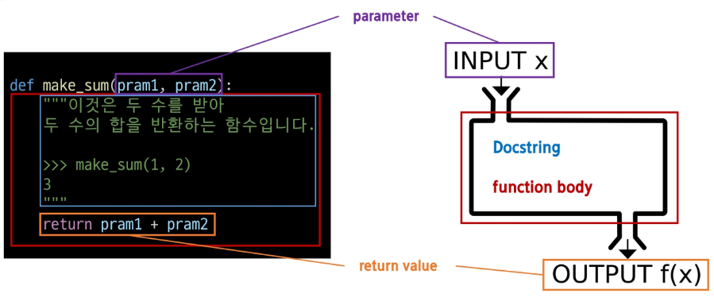
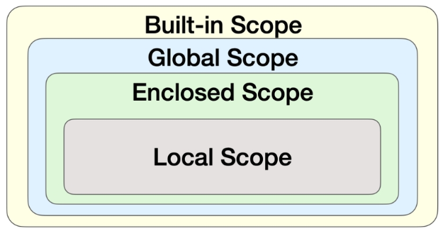

# 함수 Functions
* 특정 작업을 수행하기 위한 재사용 가능한 code 묶음
* 함수를 사용하는 이유
    * 두 수의 합을 구하는 함수를 정의하고 사용함으로써 code 중복을 방지
    * 재사용성이 높아지고, code의 가독성과 유지보수성 향상

## 내장함수 Built-in function
* python이 기본적으로 제공하는 함수(별도의 import 없이 바로 사용 가능)
* example : abs(절대값을 만드는 함수), print(terminal에 출력하는 함수), ...
* 함수 호출 function call
    * 함수를 실행하기 위해 함수의 이름을 사용하여 해당 함수의 code block을 실행하는 것
    * `function_name(arguments)` 형태로 사용. ex) `print()`

## 함수 구조
* 기본적인 함수 구조

* parameter : 매개 변수
* return value : 반환 값
* 함수의 정의와 호출
    * 함수 정의(정의)
        * 함수 정의는 `def` keyword로 시작
        * `def` keyword 이후 함수 이름 작성
        * 괄호 안에 parameter를 정의할 수 있음
        * parameter는 함수에 전달되는 값을 나타냄
    * 함수 body
        * 콜론(`:`) 다음에 들여쓰기 된 code block
        * 함수가 실행될 때 수행되는 code를 정의
        * Docstring은 함수 body 앞에 선택적으로 작성 가능한 함수 설명서
            * 주석처리시 `#`를 사용하는것이 아닌 `""" """`를 사용하는것. 보통 함수를 활용하는 설명을 사용할때 많이 사용. 함수 전용 주석이라고 생각하면 됨
    * 함수 반환 값
        * 함수는 필요한 경우 결과를 반환할 수 있음
        * `return` keyword 이후에 반환할 값을 명시
        * `return`문은 함수의 실행을 종료하고, 결과를 호출 부분으로 반환
    * 함수 호출
        * 함수를 호출하기 위해서는 함수의 이름과 필요한 인자(argument)를 전달해야 함
        * 호출 부분에서 전달된 인자는 함수 정의 시 작성한 매개변수에 대입됨


# 매개변수와 인자
* 매개변수(parameter) : 함수를 정의할 때, 함수가 받을 값을 나타내는 변수
* 인자(argument) : 함수를 호출할 때, 실제로 전달되는 값
    * 즉 `def` function body 안에 있는 것은 parameter, 실제 출력을 위해 넣는 값을 argument라고 한다. 절대 혼동하지 말것!!!

## 인자의 종류
1. Positional Arguments (위치 인자)
    * 함수 호출 시 인자의 위치에 따라 전달되는 인자
    * 위치 인자는 함수 호출 시 반드시 값을 전달해야 함
        ```python
        def greet(name, age) :
            print(f'안녕하세요, {name}님! {age}살이시군요.')

        greet('Alice', 25) # 안녕하세요, Alice님! 25살 이시군요.

        greet(30) # TypeError: greet() missing 1 required positional argument: 'age' -> name을 30으로, age는 없다고 인식
        ```
2. Default Argument Values (기본 인자 값)
    * 함수 정의에서 parameter에 기본 값을 할당 하는 것
    * 함수 호출 시 인자를 전달하지 않으면 기본 값이 매개변수에 할당됨
        ```python
        def greet(name, age=30) :
            print(f'안녕하세요, {name}님! {age}살이시군요.')

        greet('Bob') # 안녕하세요, Bob님! 30살 이시군요.

        greet(25) # 안녕하세요, 25님! 30살 이시군요.

        greet('Charlie', 40) # 안녕하세요, Charlie님! 40살이시군요.
        ```
3. Keyword Arguments (키워드 인자)
    * 함수 호출 시 인자의 이름과 함께 값을 전달하는 인자
    * parameter와 argument를 일치시키지 않고, 특정 parameter에 값을 할당할 수 있음
    * argument의 순서는 중요하지 않으며, argument의 이름을 명시하여 전달
    * 단, 호출 시 keyword argument는 positional argument 뒤에 위치해야 한다.
        ```python
        def greet(name, age) :
            print(f'안녕하세요, {name}님! {age}살이시군요.')

        greet(name = 'Dave', age = 35) # 안녕하세요, Dave님! 35살이시군요.

        greet('Dave', age = 35) # 안녕하세요, Dave님! 35살이시군요.
        greet(age=35, 'Dave') # positional argument folows keyword argument
        # '반드시' 위치 인자가 먼저 와야한다.
        ```
4. Arbitrary Argument List (임의의 인자 목록)
    * 정해지지 않은 개수의 인자를 처리하는 인자
    * 함수 정의시 parameter 앞에 `*`를 붙여 사용하며, 여러 개의 인자를 **tuple**로 처리
        ```python
        def calculate_sum(*args) :
            print(args)
            total = sum(args)
            print(f'합계 : {total}')

        calculate_sum(1, 2, 3) # (1, 2, 3)
                               # 합계 : 6
        ```
5. Arbitrary Keyword Argument Lists (임의의 키워드 인자 목록)
    * 정해지지 않은 개수의 키워드 인자를 처리하는 인자
    * 함수 정의시 parameter 앞에 `**`를 붙여 사용하며, 여러 개의 인자를 dictionary로 묶어 처리
        ```python
        def print_info(**kwargs) :
            print(kwargs)
        
        print_info(name = 'Eve', age = 30) # {'name' : 'Eve', 'age' : 30}
        ```
* 함수 argument 권장 작성 순서
    * 위치 -> 기본 -> 가변 -> 가변 키워드
    * 호출 시 인자를 전달하는 과정에서 혼란을 줄일 수 있도록함
    * 단, 모든 상황에 적용되는 절대적인 규칙은 아니며, 상황에 따라 유연학 조정될 수 있음.
        ```python
        def func(pos1, pos2, age=30, *args, **kwargs) :
            print(pos1, pos2, age, args, kwargs)

        func(1, 2, 3, 4, 5) # 1 2 3 (4, 5) {}

        func(1, 2, 3, a=100, b=200) # 1 2 3 () {'a': 100, 'b': 200}
        ```


# 함수와 Scope
* 함수 code 내부에 local scope를 생성하며, 그 외의 공간인 global scope로 구분
* scope
    * global scope : code어디에서든 참조할 수 있는 공간
    * local scope : 함수가 만든 scope (함수 내부에서만 참조 가능)
* variable
    * global variable : global scope에 정의된 변수
    * local variable : local scope에 정의된 변수
        ```python
        def func() :
            num = 20
            print('local', num) # local 20
        
        func()

        print('global', num) # NameError : name 'num' is not defined
        ```
* 변수 수명주기 (lifecycle)
    * 변수의 수명주기는 변수가 선언되는 위치와 scope에 따라 결정됨
        1. built-int scope
            * python이 실행된 이후부터 영원히 유지
        2. global scope
            * 모듈이 호출된 시점 이후 혹은 interpreter가 끝날 때까지 유지
        3. local scope
            * 함수가 호출될 때 생성되고, 함수가 종료될 때까지 유지
* 이름 검색 규칙(Name Resolution)
    * python에서 사용되는 이름(식별자)들은 특정한 이름공간(name space)에 저장되어 있음
    * 아래와 같은 순서로 이름을 찾아 나가며, LEGB Rule이라고 부름
        1. Local scope
        2. Enclosed scope
        3. Global scope
        4. Built-in scope
        * 함수 내에서는 바깥 scope의 변수에 접근 가능하나 수정은 할 수 없음
        * LEGB rule (이름 검색 규칙)
        
            ```python
            a = 1
            b = 2

            def enclosed() :
                a = 10
                c = 3

                def local(c) :
                    print(a, b, c) # 10, 2, 500
                
                local(500)
                print(a, b, c) # 10, 2, 3

            enclosed()
            print(a, b) # 1, 2
            # code를 출력하면 3개가 전부 출력된다.
            ```
* `global` keyword
    * 변수의 scope를 전역 범위로 지정하기 위해서 사용
    * 일반적으로 함수 내에서 전역 변수를 수정하려는 경우에 사용
        ```python
        num = 0 # 전역 변수

        def f() : # f()를 정의
            print(num) # f() 내부 num이 정의되지 않아
            num += 1 # num 변경이 불가능해서 error발생
            print(num)

        print(num) # 0 출력
        f() # f() 실행
        print(num)
        ```
        ```python
        num = 0 # 전역 변수

        def f() :
            global num
            num += 1

        print(num) # 0출력
        f()
        print(num) # 1출력
        ```
    * `global` keyword 주의사항
        1. `global` keyword 선언 이후 접근 해야 한다.
            * `global` keyword를 변경하지 않는다면 상관X
                ```python
                num = 0

                def f() :
                    print(num)
                    global num
                    # 뒤에 `num +=1` code가 있기 때문에 가장 먼저 선언해줘야 한다.
                    num += 1
                ```
        2. parameter에 `global` 사용 불가
            ```python
            num = 0

            def f(num) :
                global num
                # "num" is assigned before global declaration
                num += 1
            ```
        * `global` keyword는 가급적 사용하지 않는 것을 권장. 함수로 값을 바꾸고자 한다면 항상 argument로 넘기고 함수의 반환값을 사용하는 것을 권장


# 재귀 함수
* 함수 내부에서 자기 자신을 호출하는 함수
* 특징
    * 특정 알고리즘 식을 표현할 때 변수의 사용이 줄어들며, code의 가독성이 높아짐
    * 1개 이상의 base case(종료되는 상황)가 존재하고, 수렴하도록 작성
    * example : factorial
        ```python
        def = factorial(n) :
            # 종료 조건 : n == 0이면 1을 반환
            if n == 0
                return 1
            # 재귀 호출 : n과 n-1 factorial을 곱한 결과를 반환
            return n * factorial(n-1)

        result = factorial(5)
        print(result) # 120
        ```
* 주의할 점
    1. 종료 조건을 명확하게 할것
    2. 반복되는 호출이 종료 조건을 향하도록 할것


# 유용한 함수

## 유용한 내장 함수
1. `map(fumction, iterable)`
    * function = 함수, iterable = 반복가능한 sequence
    * 순회가능한 data 구조(iterable)의 모든 요소에 함수를 적용하고 그 결과를 map object로 반환
        ```python
        numbers = [1, 2, 3]
        result = map(str, numbers)

        print(result) # <map object at 0x0000021854920430>
        print(list(result)) # ['1', '2', '3']
        # numbers에 있는 모든 숫자를 문자열 str로 바꾸고 그것을 list로 출력했다.
        ```
        ```python
        # 입력값 : 1 2 3 4 5
        numbers = input().split()

        print(numbers) # ['1', '2', '3', '4', '5']

        result = map(int, numbers)
        print(result) # <map object at 0x00000231CD700430>

        print(list(result)) # [1, 2, 3, 4, 5]

        # 위 코드를 한줄로 만든것
        print(list(map(int, input().split()))) # [1, 2, 3, 4, 5]
        ```
2. `zip`(*iterables)
    * 임의의 iterable을 모야 tuple을 원소로 하는 zip object를 반환
        ```python
        girls = ['jane', 'ashley']
        boys = ['peter', 'jay']
        pair = zip(girls, boys)

        print(pair) # <zip object at 0x000001C76DE58700>
        print(list(pair)) # [('jane', 'peter'), ('ashley', 'jay')]
        ```
        ```python
        girls = ['jane', 'ashley', 'may']
        boys = ['peter', 'jay']
        pair = zip(girls, boys)

        # pair로 이뤄지지 않는 요소는 출력되지 않는다.
        print(list(pair)) # [('jane', 'peter'), ('ashley', 'jay')]
        ```

## Lambda 함수
* lambda 함수 구조 `lambda parameter : 표현식`
    * lambda keyword
        * lambda 함수를 선언하기 위해 사용되는 keyword이다.
    * parameter
        * 함수에 전달되는 parameter
        * 여러개의 parameter가 있을 경우 `,`로 구분
    * 표현식
        * 함수의 실행되는 code block으로, 결과값을 반환하는 표현식으로 작성
* lambda 함수 예시
    * 간단한 연산이나 함수를 한 줄로 표현할 떄 사용
    * 함수를 parameter로 전달하는 경우에도 유용하게 활용
        ```python
        def f(x, y) :
            return x + y
        
        result = f(3, 5)
        print(result) # 8
        ```
        ```python
        f = lambda x, y : x + y # return 생략

        result = f(3, 5)
        print(result) # 8
        ```
        ```python
        numbers = [1, 2, 3, 4, 5]
        def func(x) :
            return x**2

        result = list(map(func, numbers))

        print(result) # [1, 4, 9, 16, 25]

        # 한줄 code로 만든다면
        print(list(map(lambda x: x**2, numbers))) # [1, 4, 9, 16, 25]
        ```
* 이름 없이 정의되고 사용되는 익명 함수. 1회성!!


# Packing & Unpacking
1. Packing
    * 여러 개의 값을 하나의 변수에 묶어서 담는 것
    * 변수에 담긴 값들은 tuple 형태로 묶임
        ```python
        packed_values = 1, 2, 3, 4, 5
        print(packed_values) # (1, 2, 3, 4, 5)
        ```
    * `*`를 활용하여 패킹도 가능하다.
        * `*`는 남은 요소들을 list로 packing하여 할당
            ```python
            numbers = [1, 2, 3, 4, 5]
            a, *b, c = numbers
            print(a) # 1
            print(b) # [2, 3, 4]
            print(c) # 5
            ```
        * print함수에서 임의의 가변 argument를 작성할 수 있었던 이유
            * argument 개수에 상관없이 tuple 하나로 packing되어 내부에서 처리
            ```python
            def my_func(*objects) :
                print(objects) # (1, 2, 3, 4, 5)
                print(type(objects)) # <clss 'tuple'>
            
            my_func(1, 2, 3, 4, 5)
            # (1, 2, 3, 4, 5)
            # <class 'tuple>
            ```
2. Unpacking
* packing된 변수의 값을 개별적인 변수로 분리하여 할당하는 것
    ```python
    packed_values = 1, 2, 3, 4, 5
    a, b, c, d, e = packed_values

    print(a, b, c, d, e) # 1 2 3 4 5
    ```
* `*`를 활용한 unpacking
    * `*`는 list의 요소를 unpacking
        ```python
        names = ['Alice', 'Jane', 'Peter']
        print(*names) # Alice Jane Peter
        ```
* `**`를 활용한 unpacking
    * `**`는 dictionary의 key-value 쌍을 함수의 keyword argument로 unpacking
        ```python
        def my_function(x, y, z) :
            print(x, y, z)

        my_dict = {'x' : 1, 'y' : 2, 'z' : 3}
        my_function(**my_dict) # 1 2 3
        ```
* `*`, `**` packing/unpacking 연산자 정리
    * `*`
        * packing 연산자로 사용될 때, 여러 개의 argument를 하나의 tuple로 묶는 역할
        * unpacking 연산자로 사용될 때, sequence나 반복 가능한 객체를 각각의 요소로 unpacking하여 함수의 argument로 전달
    * `**`
        * unpacking 연산자로만 사용되며, unpacking 연산자로 사용될 때, dictionary의 key-value 쌍을 keyword argument로 unpacking하여 함수의 argument로 전달하는 역할