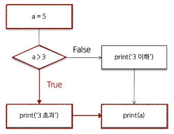
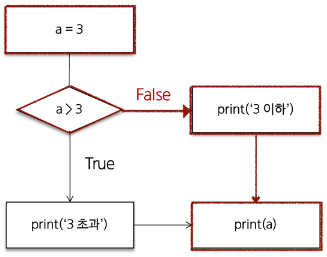

# Module

## Module 모듈
* 한 file로 묶인 변수와 함수의 모음
* 특정한 기능을 하는 code가 작성된 python file(.py)
* Module 예시
    * python의 math module
    * python이 미리 작성해 둔 수학 관련 변수와 함수가 작성된 module
        ```python
        import math

        print(math.pi) # 3.141592653589793

        print(math.sqrt(4)) # 2.0
        ```

## 모듈 활용

### module import
* module 내 변수와 함수에 접근하려면 `import`문이 필요
    ```python
    import math
    ```
* 내장 함수 `help`를 사용해 module에 무엇이 들어있는지 확인 가능
    ```python
    import math
    help(math)
    """
    NAME
        math

    DESCRIPTION
        This module provides access to the mathematical functions
        defined by the C standard.

    FUNCTIONS
        acos(x, /)
            Return the arc cosine (measured in radians) of x.
    -- More  --
    """
    ```
* `.`(dot)은 "점의 왼쪽 객체에서 점의 오른쪽 이름을 찾아라"라는 의미의 연산자
    ```python
    # module_name.변수명
    print(math.pi) # 3.141592653589793

    # module_name.function_name
    print(math.squt(4)) # 2.0
    ```
    * python은 명시적인 것을 중요시 하기 때문에 `from`절을 사용하기보다 module_name을 써주는 것을 더 권장한다.
* module을 import하는 다른 방법
    * `from`절을 활용해 특정 module을 미리 참조하고 어떤 요소를 `import`할지 명시
        ```python
        from math import pi, sqrt

        print(pi) # 3.141592653589793

        print(sqrt(4)) # 2.0
        ```
* 주의사항
    * 만약 서로 다른 module이 같은 이름의 함수를 제공할 경우 문제 발생
    * 마지막에 `import`된 이름으로 대체됨
        ```python
        from math import pi, sqrt
        from my_math import sqrt
        ```
        ```python
        # 그래서 module 내 모든 요소를 한번에 import하는 * 표기는 권장하지 않음

        from math import *
        ```

### 사용자 정의 module
* 직접 정의한 module 사용하기
    1. module my_math.py 작성
    2. 두 수의 합을 구하는 add 함수 작성
    3. my_math 모듈 `import`후 `add`` 함수 호출
        ```python
        # 'my_math.py' file 생성
        def add(x, y) :
            return x + y
        ```
        ```python
        import my_math # my_math.py를 불러옴

        print(my_math.add(1, 2)) # 3
        ```

## python 표준 라이브러리
* Python Standard Library ( = PSL)
* python 언어와 함께 제공되는 다양한 module과 package 모음
    * module < package < library
    * module이 모여 package, package가 모여 최종적으로 library라고 한다.
* [PSL](https://docs.python.org/ko/3/library/index.html)
* package 패키지
    * 관련된 module들을 하나의 directory에 모아 놓는것
        * 다음과 같은 directory 구조로 작성
        * 
            * package 3개 : my_package, math, statistics
            * module 2개 : my_math, tools
                ```python
                # my_package/math/my_math.py
                def add(x, y) :
                    return x + y
                ```
                ```python
                # my_package/statistics/tools.py
                def mod(x, y) :
                    return x % y
                ```
        * 각 package의 module을 `import`하여 사용하기
            ```python
            # sample.py
            # package에서 불러오기 위해서는 from절에 정확한 경로를 입력해야 한다.
            from my_package.math import my_math
            from my_package.statistics import tools

            print(my_math.add(1, 2)) # 3
            print(tools.mod(1, 2)) # 1
            ```
* PLS 내부 package vs 외부 package
    * PSL 내부 package : 설치 없이 바로 `import`하여 사용
    * 외부 package : 'pip'를 사용하여 설치 후 `import` 필요
        * 'pip' : 외부 package들을 설치하도록 도와주는 python package 관리 system
        * python package 관리자 (pip)
            * PyPI(Python Package Index)에 저장된 외부 package들을 설치
            * [PyPI](https://pypi.org/)
    * package 설치
        * 최신 version / 특정 version / 최소 version을 명시하여 설치할 수 있다.
            ```python
            $ pip install SomePackge
            $ pip install SomePackage==1.0.5
            $ pip install SomePackage==1.0.4
            ```
* `requests` 외부 package 설치 및 사용 예시
    ```python
    $ pip install requests
    ```
    ```python
    import requests

    url = 'https://random-data-api.com/api/v2/users'
    response = requests.get(url).json()

    print(response)
    ```
* package 사용 목적
    * module들의 이름공간을 구분하여 충돌을 방지
    * module들을 효율적으로 관리하고 재사용할 수 있도록 돕는 역할

# Control of flow

## 제어문 Control Statement
* code의 실행 흐름을 제어하는데 사용되는 구문
* **조건**에 따라 code block을 실행하거나 **반복**적으로 code 실행

## 조건문 Conditional Statement
* 주어진 조건식을 평가하여 해당 조건이 True인 경우에만 code block을 실행하거나 건너뜀
* `if / elif / else` : python 조건문에 사용되는 keyword
* 'if' statement
    * if statement의 기본 구조
        ```python
        if 표현식 :
            code block
        elif 표현식 :
            code block
        else :
            code block
        ```
    * `if`문 예시1
        ```python
        a = 5

        if  a > 3 :
            print('3 초과')
        else : 
            print('3 이하')
        print(a) # 3 초과
        ```
        
    * `if`문 예시2
        ```python
        a = 3
        
        if a > 3 :
            print('3 초과')
        else :
            print('3 이하')
        print(a) # 3 이하
        ```
        
        * 복수 조건문
            * 조건식을 동시에 검사하는 것이 아니라 순차적으로 비교
            ```python
            dust = 35

            if dust > 150 :
                print('very bad')
            elif dust > 80 :
                print('bad')
            elif dust > 30 :
                print('so so')
            else :
                print('good')
            ```
        * 중첩 조건문
            ```python
            dust = 480

            if dust > 150 :
                print('very bad')
                if dust > 300 :
                    print('dangerous! Don\'t go outside')
                # 항상 else와 붙어 다니는 것은 아니다.
            elif dust > 80 :
                print('bad')
            elif dust > 30 :
                print('so so')
            else :
                print('good')
            ```


## 반복문 Loop Statement
* 주어진 code block을 여러번 반복해서 실행하는 구문
    1. 특정 작업을 반복적으로 수행
        * 제한된 작업량이 있음
        * 언제 끝날지 알고 있음
    2. 주어진 조건이 True인 동안 반복해서 수행
        * 제한된 작업량이 없음
        * 주어진 조건이 False가 될때까지 계속 실행
        * 언제 끝날지 주어진 조건이 False가 될때 결정됨
* `for / while` : python 반복문에 사용되는 keyword

### for
* 임의의 sequence(str, tuple, list, range, ...)의 항목들을 그 sequence에 들어있는 순서대로 반복
* sequence의 요소들을 순서대로 꺼내서 반복하기 때문에 sequence의 요소 개수 만큼 반복한다.
* for statement의 기본 구조
    ```python
    # for는 in과 함께 쓰인다.
    for 변수 in 반복 가능한 객체
        code block
    ```
* 반복 가능한 객체 (iterable)
    * 반복문에서 순회할 수 있는 객체
    * sequence 객체 뿐만 아니라 dict, set 등도 포함
* `for`문 원리
    * list 내 첫 항목이 반복 변수에 할당되고 code block이 실행
    * 다음으로 반복 변수에 list의 두 번째 항복이 할당되고 code block이 다시 실행
    * ...마지막으로 반복 변수에 list의 마지막 요소가 할당되고 code block이 실행
        ```python
        # 다중 객체는 복수 형태로 사용하면 좋다
        items = ['apple', 'banana', 'coconut']

        # 그래야 단수형을 변수로 사용 가능하고 code 전체가 명시적이다.
        for item in items :
            print(item)

        """
        apple
        banana
        coconut
        """
        ```
* 문자열 순회 - 문자열도 `for`문이 가능하다..!!
    ```python
    country = 'Korea'

    for char in country :
        print(char)
    
    """
    K
    o
    r
    e
    a
    """
    ```
* `range`순회
    ```python
    for i in range(5) :
        print(i)
    
    """
    0
    1
    2
    3
    4
    """
    ```
* dictionary 순회
    ```python
    my_dict = {'x' : 10, 'y' : 20, 'z', 30}

    for key in my_dict :
        print(key)
        print(my_dict[key])
    
    """
    x
    10
    y
    20
    z
    30
    """
    ```
* index로 list 순회
    * list의 요소가 아닌 index로 접근하여 해당 요소들을 변경하기
        ```python
        numbers = [4, 6, 10, -8, 5]

        for i in range(len(numbers)) :
            numbers[i] *= 2

        print(numbers) # [8, 12, 20, -16, 10]
        ```
* 중첩된 반복문
    * 안쪽 반복문은 outers list의 각 항목에 대해 한번씩 실행됨
    * `print`가 호출되는 횟수 => `len(outers) * len(inners)`
        ```python
        outers = ['A', 'B']
        inners = ['c', 'd']

        for outer in outers :
            for inner in inners :
                print(outer, inner)

        """
        A c
        A d
        B c
        B d
        """
        ```
* 중첩 list 순회
    * 안쪽 list 요소에 접근하려면 바깥 list를 순회하면서 중첩 반복을 사용해 각 안쪽 반복을 순회
        ```python
        elements = [['A', 'B'], ['c', 'd']]

        for elem in elements :
            print(elem)

        """
        ['A', 'B']
        ['c', 'd']
        ```
        ```python
        elements = [['A', 'B'], ['c', 'd']]

        for elem in elements :
            for item in elem :
                print(item)
        
        """
        A
        B
        c
        d
        """
        ```

### While
* 주어진 조건식이 True인 동안 code를 반복해서 실행
* `==` 조건식이 False가 될 떄 까지 반복
* while statement 기본 구조
    ```python
    while 조건식 :
        code block
    ```
* while 에시
    ```python
    a = 0

    while a < 3 :
        print(a)
        a += 1

    print('끝')

    """
    0
    1
    2
    끝
    """
    ```
* 사용자 입력에 따른 반복
    * while문을 사용한 특정 입력 값에 대한 종료 조건 활용하기
        ```python
        number = int(input('양의 정수를 입력해 주세요.: '))
        
        while number <= 0 :
            if number < 0 :
                print('음수를 입력했습니다.')
            else :
                print('0의 양의 정수가 아닙니다.')
            
            number = int(input('양의 정수를 입력해주세요.: '))
        
        print('잘했습니다!')

        """
        양의 정수를 입력해 주세요.: 0
        0은 양의 정수가 아닙니다
        양의 정수를 입력해주세요.: -1
        음수를 입력했습니다.
        양의 정수를 입력해 주세요: 1
        잘했습니다!
        """
        ```
* `while`문은 반드시 **종료 조건**이 필요

### for vs while
* `for` : iterable의 요소를 하나씩 순회하며 반복
    * 반복 횟수가 명확하게 정해져 있는 경우에 유용
    * 예를 들어 list, tuple, str 등과 같은 sequence 형식의 data를 처리할 때
* `while` : 주어진 조건식이 True인 동안 반복
    * 반복 횟수가 불명확하거나 조건에 따라 반복을 종료해야 할 때 유용
    * 예를 들어 사용자의 입력을 받아서 특정 조건이 충족될 때까지 반복하는 경우
* 반복 제어
    * for문과 while은 매 반복마다 본문 내 모든 code를 실행하지만 때때로 일부만 실행하는 것이 필요할 때가 있음
    * `break` : 반복을 즉시 중지
        ```python
        # program 종료 조건 만들기
        number = int(input('양의 정수를 입력해주세요.: '))

        while number <= 0:
            if number == -9999:
                print('프로그램을 종료합니다.')
                break
            if number < 0:
                print('음수를 입력했습니다.')
            else:
                print('0은 양의 정수가 아닙니다.')
            number = int(input('양의 정수를 입력해주세요.: '))
        print('잘했습니다!')

        """
        양의 정수를 입력해 주세요.: -9999
        프로그램을 종료합니다.
        잘했습니다!
        """
        ```
        ```python
        # list에서 첫 번째 짝수만 찾은 두 반복 종료하기
        numbers = [1, 3, 5, 6, 7, 9, 10, 11]
        found_even = False
        for num in numbers:
            if num % 2 == 0:
                print('첫 번째 짝수를 찾았습니다:', num)
                found_even = True
                break
        if not found_even:
            print('짝수를 찾지 못했습니다')
        
        # 첫 번째 짝수를 찾았습니다: 6
        ```
    * `continue` : 다음 반복으로 건너뜀. continue이하의 문을 쓰지 않는다.
        ```python
        numbers = [1, 2, 3, 4, 5, 6, 7, 8, 9, 10]

        for num in numbers :
            if num % 2 == 0 :
                continue
            print(num)
        
        """
        1
        3
        5
        7
        9
        """
        ```
    * `break`와 `continue` 주의 사항
        * break와 continue를 남용하는 것은  code의 가독성을 저하시킬 수 있음
        * 특정한 종료 조건을 만들어 break를 대신하거나, if문을 사용해 continue처럼 code를 건너 뛸 수도 있음.
        * 약간의 시간이 들더라도 가능한 code의 가독성을 유지하고 code의 의도를 명확하게 작성하도록 노력하는 것이 중요

### List Comprehension
* 간결하고 효율적인 list 생성 방법
* List Comprehension 구조
    ```python
    # 둘다 같은 code이다.
    [expression for 변수 in iterable]

    list(expression for 변수 in iterable)
    ```
* List Comprehension 활용
    ```python
    numbers = [1, 2, 3, 4, 5]
    squared_numbers = []

    for num in numbers :
        squared_numbers.append(num**2)
    # append는 '.' 좌측에 추가한다는 의미의 함수

    print(squared_numbers) # [1, 4, 9, 16, 25]

    # 위아래 모두 같은 code

    numbers = [1, 2, 3, 4, 5]
    squared_numbers = [num**2 for num in numbers]

    print(squared_numbers) # [1, 4, 9, 16, 25]
    ```
    * [참고] List Comprehension if 조건문
        ```python
        # 두 code 모두 같은 code
        [expression for 변수 in iterable if 조건식]

        list(expression for 변수 in iterable if 조건식x)
        ```
        ```python
        # 같은 code이지만 아래 code가 더 가독성이 좋다.
        result = [i for i in range(10) if i % 2 == 1]

        result = []
        for i in range(10) :
            if i % == 1 :
                result.append(i)
        ```
        * comprehension을 남용하지 말자

### 참고
1. `pass`
    * 아무런 동작도 수행하지 않고 넘어가는 역할
    * 문법적으로 문장이 필요하지만 program 실행에는 영향을 주지 않아야 할 때 사용
    * 사용 예시
        1. code 작성 중 미완성 부분
            * 구현해야 할 부분이 나중에 추가될 수 있고, code를 comfile하는 동안 error가 발생하지 않음
                ```python
                def my_function() :
                    pass
                ```
        2. 조건문에서 아무런 동작을 수행하지 않아야 할 때
            ```python
            if condition :
                pass # 아무런 동작도 수행하지 않음
            else :
                # 다른 동작 수행
            ```
        3. 무한 loop에서 조건이 충족되지 않을 때 pass를 사용하여 loop를 계속 진행하는 방법
            ```python
            while True :
                if condition :
                    break
                elif condition :
                    pass # loop 계속 진행
                else :
                    print('..')
            ```
2. `enumerate`
    * `enumerate(iterable, start = 0)`
    * iterable 객체의 각 요소에 대해 index와 함께 반환하는 내장함수
        ```python
        fruits = ['apple', 'banana', 'cherry']

        for index, fruit in enumerate(fruits) :
            print(f'인덱스 {index}:{fruit}')

        """
        인덱스 0:apple
        인덱스 1:banana
        인덱스 2:cherry
        """
        ```