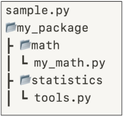

# Module

## Module 모듈
* 한 file로 묶인 변수와 함수의 모음
* 특정한 기능을 하는 code가 작성된 python file(.py)
* Module 예시
    * python의 math module
    * python이 미리 작성해 둔 수학 관련 변수와 함수가 작성된 module
        ```python
        import math

        print(math.pi) # 3.141592653589793

        print(math.sqrt(4)) # 2.0
        ```

## 모듈 활용

### module import
* module 내 변수와 함수에 접근하려면 `import`문이 필요
    ```python
    import math
    ```
* 내장 함수 `help`를 사용해 module에 무엇이 들어있는지 확인 가능
    ```python
    import math
    help(math)
    """
    NAME
        math

    DESCRIPTION
        This module provides access to the mathematical functions
        defined by the C standard.

    FUNCTIONS
        acos(x, /)
            Return the arc cosine (measured in radians) of x.
    -- More  --
    """
    ```
* `.`(dot)은 "점의 왼쪽 객체에서 점의 오른쪽 이름을 찾아라"라는 의미의 연산자
    ```python
    # module_name.변수명
    print(math.pi) # 3.141592653589793

    # module_name.function_name
    print(math.squt(4)) # 2.0
    ```
    * python은 명시적인 것을 중요시 하기 때문에 `from`절을 사용하기보다 module_name을 써주는 것을 더 권장한다.
* module을 import하는 다른 방법
    * `from`절을 활용해 특정 module을 미리 참조하고 어떤 요소를 `import`할지 명시
        ```python
        from math import pi, sqrt

        print(pi) # 3.141592653589793

        print(sqrt(4)) # 2.0
        ```
* 주의사항
    * 만약 서로 다른 module이 같은 이름의 함수를 제공할 경우 문제 발생
    * 마지막에 `import`된 이름으로 대체됨
        ```python
        from math import pi, sqrt
        from my_math import sqrt
        ```
        ```python
        # 그래서 module 내 모든 요소를 한번에 import하는 * 표기는 권장하지 않음

        from math import *
        ```

### 사용자 정의 module
* 직접 정의한 module 사용하기
    1. module my_math.py 작성
    2. 두 수의 합을 구하는 add 함수 작성
    3. my_math 모듈 `import`후 `add`` 함수 호출
        ```python
        # 'my_math.py' file 생성
        def add(x, y) :
            return x + y
        ```
        ```python
        import my_math # my_math.py를 불러옴

        print(my_math.add(1, 2)) # 3
        ```

## python 표준 라이브러리
* Python Standard Library
* python 언어와 함께 제공되는 다양한 module과 package 모음
* [python standard library](https://docs.python.org/ko/3/library/index.html)
* package 패키지
    * 관련된 module들을 하나의 directory에 모아 놓는것
        * 다음과 같은 directory 구조로 작성
        * 
            * package 3개 : my_package, math, statistics
            * module 2개 : my_math, tools
                ```python
                # my_package/math/my_math.py
                def add(x, y) :
                    return x + y
                ```
                ```python
                # my_package/statistics/tools.py
                def mod(x, y) :
                    return x % y
                ```
        * 각 package의 module을 `import`하여 사용하기
            ```python
            # sample.py
            from my_package.math import my_math
            from my_package.statistics import tools

            print(my_math.add(1, 2)) # 3
            print(tools.mod(1, 2)) # 1
            ```
* PLS 내부 package vs 외부 package
    * PSL 내부 package : 설치 없이 바로 `import`하여 사용
    * 외부 package : `pip`를 사용하여 설치 후 `import` 필요


# Control of flow

## 제어문

## 조건문

## 반복문